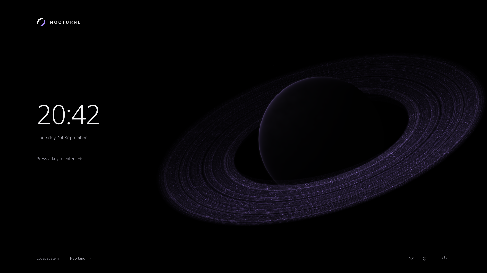

# Nocturne Greeter — Umbra preview + isolated harness 0.6

Preview em Quickshell/QML + GLSL: um corpo obsidiano com matéria orbital, identidade de eclipse e autenticação em uma coluna editorial. Executa dentro da sessão atual. Não altera display manager, PAM, boot ou serviços de login.



## Iniciar

```sh
~/.config/nocturne-greeter/scripts/run-preview.sh
```

Abre em tela cheia no monitor primário. `Ctrl+Q` encerra; `Alt+F4` também fecha.

```sh
NOCTURNE_WINDOWED=1 NOCTURNE_WIDTH=1280 NOCTURNE_HEIGHT=720 ~/.config/nocturne-greeter/scripts/run-preview.sh
```

Em compositores com tiling, a geometria solicitada pode ser substituída pelo layout do compositor. As dimensões efetivas guiam a composição.

## Interações

- Clique no fundo ou pressione uma tecla: WAKE, seguido de AUTH; campo recebe foco imediatamente.
- Digitação: pontos mascarados e perturbação mínima da matéria orbital.
- `Enter` ou seta: tentativa simulada, seguida de falha curta em lilás.
- `Ctrl+Enter`: sucesso visual de preview, convergência e preto. Não autentica ninguém.
- `Esc`: fecha menu aberto; no fluxo de autenticação retorna ao idle e limpa a senha.
- Sessão: mostra o ambiente atual. Energia: abre controles explicitamente desabilitados.
- Rede, áudio e bateria são somente leitura. Bateria só aparece quando aplicável.

O preview não registra nem persiste a senha. Use texto de teste, pois não existe autenticação real.

Para revelar os controles de desenvolvimento:

```sh
NOCTURNE_DEBUG=1 ~/.config/nocturne-greeter/scripts/run-preview.sh
```

`NOCTURNE_USER_NAME` permite alterar apenas o nome exibido; por padrão usa `USER`. Hostname usa `HOSTNAME`/`HOST`, com fallback “Local system”. A interface está em inglês; a data segue o locale do Qt.

## Arquitetura

| Arquivo | Papel |
| --- | --- |
| `shell.qml` | Entrada do preview |
| `components/GreeterWindow.qml` | Composição responsiva, foco, relógio do shader |
| `components/GreeterController.qml` | IDLE → WAKE → AUTH → AUTHENTICATING → SUCCESS/FAILURE; retorno ao idle |
| `components/PreviewAuthenticator.qml` | Adaptador simulado, cancelamento de tentativa pendente |
| `components/CosmicScene.qml` | Uniforms e ShaderEffect |
| `components/AuthPanel.qml` | Identidade, senha mascarada, feedback |
| `components/ClockDisplay.qml` | Relógio editorial e data |
| `components/SystemChrome.qml`, `IconButton.qml` | Indicadores e menus com dados fornecidos pelo entrypoint |
| `components/LiveSystemStatus.qml` | Rede, áudio, bateria e sessão somente no preview da sessão atual |
| `components/AuthenticatorBridge.qml` | Fronteira entre state machine e backend do harness |
| `components/PreviewCapture.qml` | Captura opt-in, ausente do fluxo normal |
| `shaders/pulse.frag`, `.qsb` | Esfera e planos orbitais analíticos; pacote Qt |
| `assets/` | Marca e ícones SVG próprios |

Fontes instaladas: **Noto Sans Light** no relógio; **Adwaita Sans** na interface; **Adwaita Mono** apenas no debug. Nenhuma fonte ou dependência foi baixada. O preview usa Quickshell e serviços de rede, PipeWire e UPower; o harness usa dados mock e funciona sem barramento de sessão. Build/testes usam as ferramentas Qt 6 já instaladas.

## Harness Wayland isolado 0.6

```sh
~/.config/nocturne-greeter/scripts/run-isolated-greeter.sh
```

Abre KWin Wayland **aninhado** em uma janela da sessão atual, cria socket/runtime/D-Bus próprios e carrega uma cópia temporária do Umbra com backend falso. `Enter` produz falha mock; `--mock-success` avalia o SUCCESS visual sem autenticar nem lançar sessão. Encerre com `Ctrl+C` no terminal. Os logs ficam em `logs/isolated-greeter/`.

Para testar sem D-Bus de sessão ou capturar um estado:

```sh
~/.config/nocturne-greeter/scripts/run-isolated-greeter.sh --no-session-bus --duration 10
~/.config/nocturne-greeter/scripts/run-isolated-greeter.sh --scenario success
```

O harness **não** altera o Plasma Login Manager e ainda depende do Wayland/GPU da sessão host como compositor pai. Leia [o relatório completo 0.6](docs/ISOLATED_GREETER_HARNESS_0.6.md) e [a arquitetura de login 0.5](docs/REAL_LOGIN_ARCHITECTURE_0.5.md) antes de considerar qualquer passo pré-login real.

## Verificação e capturas

```sh
~/.config/nocturne-greeter/scripts/build-shader.sh
~/.config/nocturne-greeter/scripts/test-greeter.sh
~/.config/nocturne-greeter/scripts/lint-qml.sh
```

Os testes Qt Quick offscreen verificam estados, teclado, clique/foco e submissão. Não substituem avaliação visual.

```sh
cd ~/.config/nocturne-greeter
./scripts/capture-preview.sh
```

A captura abre previews temporários em tela cheia, um processo por estado. Em 1920×1080 inclui também `typing-long` para revisar o limite visual dos pontos da senha. Renderiza canvases Qt nas dimensões 1280×720, 1920×1080, 2560×1440 e 3440×1440 sem alterar a resolução do monitor. Saída: `docs/screenshots/final/`. Não equivale a testar quatro monitores físicos. O layer adicional existe somente no modo de captura.

Veja [a revisão e suas limitações](docs/ART_DIRECTION_REVIEW.md), [o sistema visual](DESIGN.md) e [as referências estudadas](docs/REFERENCE_NOTES.md).

## Captura temporal longa

Para manter o shader rodando em idle ou AUTH por cerca de 30 segundos e salvar uma imagem de verificação (use um diretório já existente):

```sh
NOCTURNE_CAPTURE_DIR=/tmp NOCTURNE_CAPTURE_STATE=idle-long ~/.config/nocturne-greeter/scripts/run-preview.sh
NOCTURNE_CAPTURE_DIR=/tmp NOCTURNE_CAPTURE_STATE=auth-long ~/.config/nocturne-greeter/scripts/run-preview.sh
```

Cada execução encerra depois da captura. Isso permite conferir a fase orbital após espera; não é uma gravação de vídeo.

## Histórico e snapshots

O primeiro histórico público descreve o estado atual Umbra 0.6 em commits temáticos, sem reconstruir versões históricas. Snapshots e scripts locais de restauração dependem de `backups/`, que não é distribuído. Para recuperar o estado publicado, use os commits Git disponíveis no clone.

## Autenticação futura

O harness fornece apenas a fronteira `AuthenticatorBridge` e um mock. Ainda faltam adapter real, prompts PAM completos, modelos seguros de usuários/sessões, capacidades de energia e testes em VM/TTY. Nenhuma dessas operações está ligada ao sistema atual. Configuração de login real exige uma tarefa separada.
