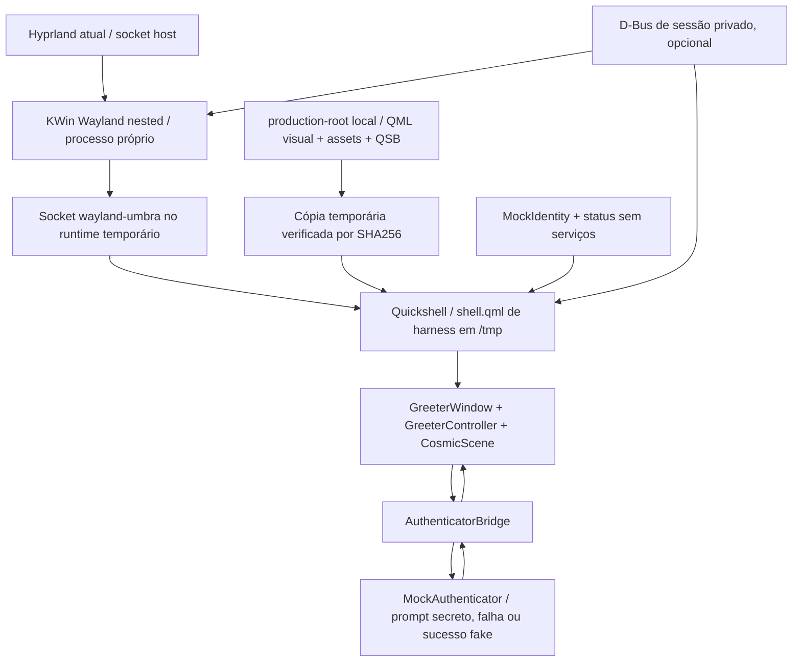

# Nocturne Greeter 0.6 — isolated greeter harness

**Estado:** experimento local com autenticação falsa. Nenhuma unit, arquivo PAM, pacote, VT, sessão ou configuração de login do host foi alterada.

**Base:** [arquitetura 0.5](REAL_LOGIN_ARCHITECTURE_0.5.md).

**Comando:** `scripts/run-isolated-greeter.sh`, executado na raiz do projeto.

**Encerramento:** `Ctrl+C` no terminal que iniciou o harness; processos e runtime temporário são removidos, logs ficam em `logs/isolated-greeter/run.*/`.

## 1. Objetivo e resultado

Provar que Umbra consegue carregar em um **socket Wayland próprio**, fornecido por um compositor aninhado, com `HOME`, runtime, cache e D-Bus de sessão separados. O cliente Quickshell lê uma cópia staged em `/tmp/nocturne-isolated.*/stage`, não o projeto como configuração runtime. A UI usa fixtures de usuário/sessão/status e `MockAuthenticator`; não há greetd, PAM nem lançamento de Hyprland.

**Resultado demonstrado:** KWin Wayland aninhado abriu socket isolado; Quickshell carregou a UI; o shader QSB renderizou com OpenGL na NVIDIA RTX 4060; IDLE, AUTH, FAILURE e preto final de SUCCESS foram capturados pelo próprio Qt; a suíte QML completa passou **30/30** sob Qt Wayland nesse socket, com Quickshell concorrente. A captura Qt de IDLE teve glifos inconsistentes em algumas execuções (seção 16), então ela não prova sozinha a composição final da janela. **Isso ainda não prova greeter pré-login real:** o KWin aninhado depende do socket Wayland e da GPU da sessão host, e os processos continuam sob o usuário de desenvolvimento.

## 2. Compositor escolhido

**KWin Wayland, somente para o harness 0.6.** O binário `/usr/bin/kwin_wayland` já está instalado e sua CLI atual oferece `--wayland-display`, `--socket`, `--width`, `--height` e `--output-count`. O teste prático criou um socket em runtime temporário sem afetar o Wayland do Hyprland. KWin também é o compositor usado pelo PLM **atual** no pré-login, o que fornece evidência local de compatibilidade com Qt Wayland; o modo aninhado não é idêntico ao modo DRM do PLM.

Essa escolha é pragmática para **provar a UI agora**, não uma decisão de compositor de produção. KWin consome mais memória e traz mais dependências de desktop que o ideal de um greeter pequeno. Cage ou outro compositor menor continuam candidatos futuros, a serem ensaiados em VM quando disponíveis sem instalar nada no host nesta fase.

## 3. Candidatos considerados

| Candidato | Instalado | Nested/Qt Wayland | Vantagem | Limite para 0.6 / pré-login |
|---|---:|---|---|---|
| KWin Wayland | Sim | **Provado** com socket e outputs próprios | Mesmo compositor da tela PLM; flags explícitas; foco/mouse/teclado via Qt Wayland | Grande; depende de partes KDE; nested não prova DRM/seat; multimonitor ainda exige política. |
| Hyprland | Sim | Tecnicamente possível, não executado como segunda sessão | Familiar e aceleração disponível | Config pessoal, plugins/serviços e complexidade de uma segunda sessão; prova menos o isolamento desejado. |
| Cage | Não | Upstream descreve uso kiosk/nested | Pequeno e apropriado para um greeter dedicado | Não instalado; comportamento multimonitor e compatibilidade Umbra não comprovados. |
| Weston | Não | Compositor de referência com backend Wayland | Boa plataforma de diagnóstico | Não instalado; não justifica instalação no host só para esta fase. |
| Sway/labwc/wayfire/gamescope | Não encontrados | Desconhecido nesta máquina | Alternativas possíveis | Sem binário local; custo/configuração não justificados para o experimento. |

Os critérios considerados foram entrada, fullscreen, socket próprio, outputs, GPU, inicialização determinística, dependências, segurança, footprint, manutenção e recovery. Para 0.6, KWin é o único candidato instalado que também tem evidência direta de uso por um greeter nesta máquina. Para produção, Cage ou equivalente minimalista pode superar KWin, mas isso exige prova em VM. Fontes: [documentação KDE de KWin aninhado](https://community.kde.org/KWin/Wayland#Starting_a_nested_KWin), [manual Cage](https://github.com/cage-kiosk/cage/blob/master/cage.1.scd), [configuração Cage](https://github.com/cage-kiosk/cage/wiki/Configuration).

## 4. Evidência da escolha

Um probe inicial com `kwin_wayland --wayland-display <socket-host> --socket wayland-nocturne-probe` criou o socket no runtime temporário; `wayland-info` conectou a ele e listou `wl_compositor`, `wl_seat` e `wl_output`. O socket host permaneceu presente. O harness repetiu esse resultado em todas as execuções normais. Com `--outputs 2`, `wayland-info` enumerou **WL-0 e WL-1**.

`--width 1280 --height 720` é pedido ao KWin, mas o Hyprland host redimensionou sua janela aninhada; o primeiro output efetivo observado foi **931×996**. Com duas janelas de output, cada uma apareceu como **931×491**. Não tratar os argumentos de tamanho do nested como prova de render a 1280×720 ou de policy final de monitores.

## 5. Arquitetura do harness



O script usa `setsid` para KWin, Quickshell e o barramento temporário, guarda seus PIDs, monitora se compositor e cliente continuam vivos, encerra só os grupos pertencentes ao harness e remove o diretório `/tmp` no `EXIT`/`INT`/`TERM`. Não usa `killall`, não troca VT e não chama PLM/greetd. Os logs persistem para diagnóstico.

## 6. Ambiente mínimo controlado

O script constrói explicitamente o ambiente de KWin/Quickshell com `env -i` **depois** de mapear as necessidades no código e no probe. A sessão host é usada apenas para o **socket pai** do compositor aninhado. Quickshell recebe só o socket **filho**.

| Variável/recurso | Classe | Valor no harness / motivo |
|---|---|---|
| `XDG_RUNTIME_DIR` | REQUIRED | `/tmp/nocturne-isolated.*/runtime`, modo 0700; contém socket Wayland filho e bus opcional. |
| `WAYLAND_DISPLAY` para Quickshell | REQUIRED | `wayland-umbra`; distinto do `wayland-1` host observado. KWin recebe caminho absoluto do socket host por `--wayland-display`. |
| `HOME`, `XDG_CONFIG_HOME`, `XDG_CACHE_HOME`, `XDG_DATA_HOME`, `XDG_STATE_HOME` | REQUIRED/CONTROLLED | Diretórios temporários próprios; impedem leitura de dotfiles/config/cache do usuário no runtime do cliente. O projeto é lido apenas para staging. |
| `USER`, `LOGNAME` | CONTROLLED | `nocturne-harness`; o usuário **alvo** exibido vem de `MockIdentity`, não dessas variáveis. UID do processo continua sendo o da conta que executa o harness. |
| `PATH` | REQUIRED | `/usr/bin:/bin`, sem executáveis de diretórios pessoais. |
| `XDG_DATA_DIRS`, `XDG_CONFIG_DIRS` | REQUIRED/QUESTIONABLE | `/usr/local/share:/usr/share`, `/etc/xdg` para módulos/fontes/config de sistema. Ainda há leitura de configuração global. |
| `QT_QPA_PLATFORM` | REQUIRED | `wayland`; impede backend xcb/offscreen acidental. |
| `XDG_SESSION_TYPE` | OPTIONAL | `wayland`; sinaliza contexto, não cria sessão logind. |
| `LANG` | REQUIRED | Locale herdada explicitamente; outras variáveis de locale não são passadas. |
| `QSG_RENDER_LOOP` | OPTIONAL | `threaded`, mesma estratégia do preview aprovado. |
| `QSG_INFO` | DIAGNOSTIC | `1`; registra backend Qt Quick/OpenGL, sem mudar shader. |
| `DBUS_SESSION_BUS_ADDRESS` | OPTIONAL | Socket de `dbus-daemon` privado. `--no-session-bus` remove a variável **e não inicia bus**. |
| `DISPLAY`, `XDG_CURRENT_DESKTOP`, `DESKTOP_SESSION` | PREVIEW-ONLY/OMITTED | O harness não depende do X11 nem de identidade da sessão Hyprland. |
| `QT_PLUGIN_PATH`, `QML_IMPORT_PATH`, `LD_*`, `FONTCONFIG_*` pessoais | UNSAFE/OMITTED | Qt, QML, drivers e fontes vêm dos caminhos instalados de sistema. |
| `NOCTURNE_*` de preview/capture/debug | PREVIEW-ONLY/OMITTED | Apenas opções `NOCTURNE_HARNESS_*` geradas pelo script são passadas ao shell de teste. |
| GPU/driver do host | UNKNOWN para pré-login | Renderer real no nested foi NVIDIA/OpenGL; DRM direto e conta de greeter continuam sem prova. |

Esta classificação separa o que o **harness** requer do que será seguro **pré-login**: um runtime temporário sob a conta de desenvolvimento não equivale ao runtime de uma conta de greeter criada por logind.

## 7. Dependências e paths

Binários usados já estavam instalados: `kwin_wayland`, `quickshell`, `dbus-daemon`, `setsid`, `rg`, ferramentas Qt, `glslangValidator`, `wayland-info`. Fontes globais resolvidas com `fc-match`: **Noto Sans**, **Adwaita Sans**, **Adwaita Mono**. Nenhuma fonte foi copiada/redistribuída.

O inventário do código identificou dependências de `$USER`, `HOSTNAME`, `XDG_CURRENT_DESKTOP`, `DESKTOP_SESSION`, `NOCTURNE_CAPTURE_DIR`, `NOCTURNE_DEBUG`, `Pipewire`, `Networking` e `UPower`. As leituras de ambiente de preview agora ficam no `shell.qml` de desenvolvimento; `GreeterWindow` recebe identidade/status explicitamente. `SystemChrome` virou componente visual com propriedades de status. `LiveSystemStatus.qml` permanece **apenas** no preview da sessão atual e não é copiado para a staging tree. `CosmicScene` usa caminho relativo para QSB; icons/SVG também usam caminhos relativos. Os componentes staged não contêm paths pessoais absolutos.

O runner lê os fontes do próprio diretório do projeto para gerar uma cópia em `/tmp`; isso **não é seguro nem suficiente para produção**. A produção futura exigirá assets de propriedade administrativa e uma conta de greeter dedicada, distinta da conta de desenvolvimento.

## 8. Staging filesystem

`scripts/stage-isolated-greeter.sh` gera localmente:

```text
production-root/
├── README.md
├── etc/nocturne-greeter/README.md  (placeholder; não é configuração ativa)
└── usr/share/nocturne-greeter/
    ├── components/                   (QML visual e AuthenticatorBridge)
    ├── assets/                       (SVG originais do Umbra)
    ├── shaders/pulse.frag.qsb
    └── SHA256SUMS
```

O script copia uma **lista permitida** de componentes, rejeita symlinks em assets e calcula hashes. O runner copia a árvore para `/tmp`, verifica os hashes e só então acrescenta `harness/shell.qml`, `MockAuthenticator`, `MockIdentity`, `HarnessScenario` e `HarnessMetrics` à **cópia temporária**. `production-root` não contém mock, `PreviewAuthenticator`, `PreviewCapture`, `LiveSystemStatus`, shell executável, greetd config ou PAM. Nada é escrito em `/usr` ou `/etc` reais. O diretório é uma simulação, **não um pacote instalável**.

O snapshot anterior a 0.6 está em `backups/umbra-0.6-pre-harness/files/` com 38 arquivos e `SHA256SUMS` verificado. Para restaurar o preview anterior dentro do projeto, depois de fechar os previews, execute da raiz do projeto `sha256sum -c backups/umbra-0.6-pre-harness/SHA256SUMS` e `cp -a -- backups/umbra-0.6-pre-harness/files/. .`. Os novos arquivos de harness/documentação permanecem no disco, mas o shell e os componentes originais voltam; nenhum arquivo de login do host participa desse rollback.

## 9. Development vs production

O preview original mantém `scripts/run-preview.sh`, `PreviewAuthenticator`, `Ctrl+Enter` de sucesso, `Ctrl+Q`, `PreviewCapture`, live status e variáveis `NOCTURNE_*`. A staging visual exclui esses adapters e o shell de preview. O harness tem **outro shell**, mock e fixtures adicionados somente no runtime temporário. `AuthPanel.previewShortcutsEnabled` é `false` por padrão e o shell do harness fixa `false`; `Ctrl+Enter` nele envia uma tentativa normal ao backend fake e **não** solicita sucesso de preview. O mock de sucesso é selecionado no processo de teste com `--mock-success` ou `--scenario success`.

**Limite explícito:** alguns métodos de compatibilidade de preview e a camada de debug condicional ainda existem nos componentes visuais compartilhados. Não há um entrypoint de produção real nem pacote pronto para instalar. Antes de produzir pacote 0.7+, será necessário retirar a API de preview do artefato final ou provar por inspeção/empacotamento que nenhuma rota de bypass está alcançável. Nenhuma flag desta fase deve ser interpretada como segurança de autenticação real.

## 10. Authenticator boundary

`AuthenticatorBridge.qml` conecta `GreeterController.authenticationRequested` a `backend.respond(secret)` e liga eventos de backend a `rejectAuthentication` ou `completeAuthentication`. Quando WAKE começa, chama `backend.begin(userId, sessionId)`; em RETURN/IDLE, chama `backend.cancel()`. O contrato mock expõe `prompt(message, responseRequired, echoResponse, error)`, `message`, `failure` e `readyToLaunch`, inspirados nos conceitos da [API Greetd do Quickshell](https://quickshell.org/docs/v0.3.0/types/Quickshell.Services.Greetd/Greetd/) e no [protocolo greetd](https://raw.githubusercontent.com/kennylevinsen/greetd/master/man/greetd-ipc-7.scd). Não foi importado nem iniciado `Quickshell.Services.Greetd` nesta fase.

O bridge atual só apresenta **prompt secreto** na UI existente. Prompts visíveis, múltiplos desafios, mensagens informativas recuperáveis e semântica de `readyToLaunch` real exigem trabalho futuro. `completeAuthentication` no harness significa **sucesso visual fake até preto**, sem executar sessão. O controller não conhece PAM.

## 11. Mock backend e identidade

`MockAuthenticator` emite um prompt secreto, descarta a resposta sem guardá-la/logá-la e após 360 ms emite falha por padrão ou `readyToLaunch` de teste. Cancelamento interrompe o timer e previne callback tardio. `MockIdentity` distingue `userId="umbra-fixture"` de `displayName="Nocturne User"`, usa `sessionId="hyprland-mock"` e fornece uma lista mock de sessões e capacidades power desabilitadas. A lista de sessões está modelada como fixture; **a UI ainda não permite selecioná-las**. Não se conclui usuário alvo a partir de `$USER`.

## 12. D-Bus

O runner inicia um `dbus-daemon --session` com endereço `unix:path=` dentro do runtime 0700 e encerra exatamente esse PID no cleanup. O endereço do bus host não é repassado. `--no-session-bus` não inicia o bus privado nem fornece a variável aos clientes. Essa execução carregou Quickshell com dois outputs, sem warnings de QML/status. O system bus ainda é visível para o processo do usuário host; o teste não comprova políticas de uma conta de greeter pré-login. Portal, PipeWire e serviços systemd de usuário da sessão de desenvolvimento **não são necessários** para a UI staged.

## 13. Serviços opcionais

`LiveSystemStatus` concentra `Quickshell.Networking`, `Pipewire` e `UPower` no preview normal. `SystemChrome` consome valores simples e oculta rede, áudio e bateria se marcados indisponíveis. No harness, `MockIdentity` marca todos como indisponíveis; sessão e power menu permanecem falsos/desabilitados. Não há polling de shell. É uma degradação funcional verificada com sessão D-Bus privada e sem bus; acesso real a NetworkManager/UPower no greeter ainda é desconhecido.

## 14. GPU, shader e SUCCESS

`QSG_INFO=1` mostrou Qt Quick threaded render loop e QRhi **OpenGL**, renderer `NVIDIA GeForce RTX 4060/PCIe/SSE2`, OpenGL ES 3.2, driver `615.71.09`; não apareceu fallback software. `CosmicScene` carregou `pulse.frag.qsb` da cópia temporária e renderizou nas capturas. O QSB reconstruído por `scripts/build-shader.sh` manteve o mesmo SHA-256 (`c4868a489216f3f5b027b350541483d74352750d39592b6ddc6de57f4bc695f6`). `glslangValidator` passou. A captura `nested-success.png` foi verificada por pixels: máximo RGB **0** em toda a imagem, portanto #000000 no estado final mock.

Isso prova funcionamento no backend OpenGL **aninhado** com GPU da sessão host; não prova driver/DRM, render node ou fallback gráfico no pré-login real. `--fault shader` remove QSB só da cópia temporária: Quickshell permanece operável, registra warning claro e o runner retorna erro após detectar a falta do shader.

## 15. Fontes

`fc-match` encontrou `NotoSans-Regular.ttf`, `AdwaitaSans-Regular.ttf` e `AdwaitaMono-Regular.ttf` do sistema; o harness não usa configuração fontconfig pessoal nem copia fontes. O pacote futuro deverá declarar as dependências de fonte e provar resolução sob a conta do greeter.

## 16. Input

O preview existente continuou funcional: captura de IDLE pela rota `scripts/run-preview.sh` passou após a separação do adapter. A suíte QML offscreen passou **30/30**; inclui primeira tecla, senha mascarada, Backspace, Enter, Escape, foco, cinco falhas consecutivas, cancelamento e sucesso fake. A suíte **nova do harness** passou **8/8** como cliente Qt Wayland dentro do KWin aninhado, incluindo `Ctrl+Enter` sem bypass, prompt/falha/sucesso mock e cancelamento. QTest sintetiza eventos na janela de teste; não substitui uma revisão manual de teclado/mouse físico na janela Quickshell do nested.

A primeira execução da suíte completa sob KWin aninhado passou **21/30**: nove verificações funcionais usavam esperas fixas para timers/estados, enquanto Quickshell e qmltestrunner competiam no compositor nested. Os testes foram corrigidos para aguardar a fase esperada com timeout explícito de 1200 ms; as verificações que de fato examinam o tempo/progresso do motion mantiveram suas durações. A execução final concorrente passou **30/30** em 37,0 s. Isso comprova os fluxos testados no QtTest nested, mas não substitui teste humano de teclado/mouse físico nem mede latência de apresentação de frames.

Em algumas execuções de `--scenario idle`, `QQuickItem.grabToImage` produziu **glifos parciais** (por exemplo, apenas os últimos dígitos do relógio ou parte da marca), enquanto o hero permaneceu completo; a captura AUTH posterior mostrou os textos. Atrasar a captura e ativar uma camada Qt extra não eliminaram a inconsistência, portanto ambas as alterações experimentais foram revertidas. `spectacle -b -n -a` retornou erro no host e não forneceu uma captura independente da janela. Ainda não é possível distinguir artefato de readback Qt de um problema na apresentação real do IDLE; isso requer observação humana/captura externa adequada antes de afirmar que a composição inicial está validada.

O capture hook agora verifica se o controller está realmente na fase solicitada antes de gravar o PNG; mismatch gera diagnóstico e exit não zero do runner. Depois dessa checagem, IDLE, FAILURE e SUCCESS foram capturados novamente; uma captura IDLE mostrou todos os textos, mas as anteriores justificam manter a limitação acima. SUCCESS continuou com RGB máximo 0 em todos os pixels.

## 17. Multimonitor

`--outputs 2` criou dois `wl_output` (`WL-0`, `WL-1`) no socket isolado, com modos 931×491 no teste. `GreeterWindow` ainda escolhe `Quickshell.screens[0]`; a UI de autenticação ocupa uma saída. Política futura proposta: UI completa em uma saída primária **determinística**, fundos pretos ou cena auxiliar nas demais, sem duplicar campos de senha nem dividir foco. A ordem/primary real, hotplug, escala e navegação entre monitores **não** foram provados; a janela host foi redimensionada pelo Hyprland. Não houve alteração de outputs físicos.

## 18. Process lifecycle

O runner valida pré-condições, cria staging/temp, verifica SHA-256, inicia bus privado opcional, inicia KWin e espera socket, inicia Quickshell e monitora ambos. Em saída normal, erro ou `Ctrl+C`, encerra somente seus grupos de processos, espera seus PIDs, remove o runtime e mantém logs. Um teste real de `Ctrl+C` confirmou saída 130, mensagem de cleanup, runtime removido e ausência de processos do harness. `--duration N` encerra automaticamente após N segundos; `--scenario` captura estado e faz o Quickshell sair por `Qt.quit()`.

Durante a primeira implementação, `dbus-run-session` como wrapper antecipou sua própria saída com `Ctrl+C` e deixou processos órfãos. Os PIDs **do harness** foram identificados e encerrados; o runtime foi removido. A versão final gerencia um `dbus-daemon` privado diretamente e passou no mesmo teste. Nenhum processo do host foi sinalizado. `SIGKILL` do script ou queda de energia ainda não permite trap; recuperação manual de PIDs/temp é limitação de qualquer runner de usuário.

## 19. Logging

Cada execução cria `logs/isolated-greeter/run.XXXXXX/` com `compositor.log`, `quickshell.log` e, quando aplicável, `dbus.log` e `nested-<state>.png`. Diretórios/logs são criados sob `umask 077`. Logs incluem configuração carregada, backend gráfico e erros; não contêm senha nem resposta mock. `HarnessMetrics` registra apenas intervalos de `shaderTime`. Capturas automáticas são **somente do harness**, não entram na staging visual.

## 20. Security observations

- O runtime temporário e seus sockets são 0700; `env -i` remove `LD_*`, `QT_PLUGIN_PATH`, `QML_IMPORT_PATH`, `DISPLAY` e DBus host dos clientes.
- Binários vêm de `PATH=/usr/bin:/bin`; nenhum caminho executável é construído com entrada de usuário. O script chama binários específicos, sem `eval`.
- Staging rejeita symlinks em assets, copia componentes de allowlist e verifica hashes antes do lançamento.
- Quickshell e KWin rodam como o usuário de desenvolvimento, com acesso possível ao system bus/hardware da sessão; **não** é sandbox de segurança nem simulação de privilege boundary real.
- A árvore `production-root` e o projeto ainda são graváveis pela conta de desenvolvimento; isso seria inaceitável para uma tela de login instalada.
- As strings QML/JS do campo de senha seguem o risco descrito em 0.5; o mock descarta sem log, mas não zeroiza memória.
- O `GreeterController` ainda contém compatibilidade preview, embora a rota `Ctrl+Enter` esteja desligada no harness. O artefato final exigirá auditoria de bypass antes de autenticação real.

## 21. Failure injection

| Fixture/ensaio | Resultado | Cleanup |
|---|---|---|
| QML inválido **só na cópia /tmp** (`--fault qml`) | Quickshell reportou `Failed to load configuration` e runner saiu com erro. | Runtime removido, log retido. |
| Executável Quickshell ausente **só no comando de teste** (`--fault quickshell`) | Runner detectou saída no startup. | Runtime removido. |
| Encerrar KWin nested depois de iniciar (`--fault compositor`) | Quickshell perdeu o display; runner saiu com erro. | Só processos do harness encerrados. |
| QSB removido **só da cópia /tmp** (`--fault shader`) | Warning `Failed to find shader`/`shader preparation failed`; runner retornou erro após diagnóstico. | Runtime removido; fonte/QSB aprovado intactos. |
| Mock falha por padrão | AUTH → FAILURE → AUTH em tests/captura. | Timer cancelável; sem PAM. |
| Sem bus de sessão (`--no-session-bus`) | UI e dois outputs iniciaram; status opcionais permaneceram ocultos. | Não iniciou dbus-daemon. |

Uma primeira variante da injeção de compositor passou um socket pai inexistente ao KWin 6.7.5 e causou crash **do processo nested**, além de abortar o cliente quando o socket sumiu. Esse método foi abandonado; o runner agora envia TERM controlado apenas ao KWin que ele iniciou e desabilita core dumps (`ulimit -c 0`). O PLM, o Hyprland e o socket host permaneceram ativos.

## 22. Performance observada

Medições de aproximadamente **8 segundos** com saída nested efetiva 931×996, host a 180 Hz; CPU é porcentagem de **um núcleo**. Números são amostra local, não benchmark pré-login.

| Estado | Quickshell CPU / RSS | KWin nested CPU / RSS | Cadência `shaderTime` |
|---|---|---|---|
| IDLE | ~5,37% / 295,4 MiB | ~2,87% / 340,4 MiB | 359 amostras: mediana 16 ms, p95 17 ms, p99 17 ms. |
| AUTH (hold mock) | ~6,12% / 296,7 MiB | ~3,00% / 339,8 MiB | 359 amostras: mediana 16 ms, p95 17 ms, p99 18 ms. |

RSS não cresceu de forma evidente nessas amostras (variação medida zero/negativa). O socket KWin ficou pronto em **~407–511 ms**; ambos os processos estavam vivos em **~1,41–1,52 s**. Não há timestamp de primeira imagem no log, então esse valor é **limite superior grosseiro**, não “time to first visible frame”. O Qt logou animation driver sincronizado ao host de 180 Hz, mas a propriedade do shader manteve ~16 ms. Essa métrica mede atualização QML; **não mede todos os frames apresentados ou GPU frame time**. Não é diretamente comparável ao baseline antigo do preview isolado sem compositor extra.

## 23. Testes e validação

- `scripts/test-greeter.sh`: **30 passed, 0 failed** offscreen após a separação.
- `qmltestrunner -input tests/tst_harness.qml -platform wayland` no socket nested: **8 passed, 0 failed**.
- Suíte completa `qmltestrunner -input tests -platform wayland` sob nested concorrente: **30 passed, 0 failed** em 37,0 s após trocar waits funcionais frágeis por `tryCompare` com timeout explícito. A primeira execução havia dado 21/30; durações de motion em produção não foram alteradas.
- `scripts/lint-qml.sh`: `qmllint` limpo no preview/testes e no shell/mock copiados para o mesmo layout staged usado no runtime. Isso evita warnings artificiais de import relativo ao lintar `harness/shell.qml` fora da staging.
- `scripts/build-shader.sh`: QSB recompilado, SHA-256 idêntico ao anterior.
- `glslangValidator -S frag -V shaders/pulse.frag`: passou.
- `bash -n scripts/*.sh`: passou.
- Preview normal: captura `1280x720-idle.png` gerada via `scripts/run-preview.sh` após refatoração.
- Nested: cenários IDLE, AUTH, FAILURE, SUCCESS/BLACK, bus privado e ausente, 1 e 2 outputs, fault fixtures e `Ctrl+C`.
- `sha256sum -c` na cópia staged a cada run; sem arquivos de preview adapter/capture na staging.

## 24. Comandos úteis

```bash
# Execute os comandos a partir da raiz do projeto.
# Interativo; Enter falha no mock. Ctrl+C no mesmo terminal encerra e limpa.
./scripts/run-isolated-greeter.sh

# Resultado de sucesso falso para avaliar o motion, ainda sem login real.
./scripts/run-isolated-greeter.sh --mock-success

# Capturas automáticas isoladas em logs/isolated-greeter/run.*/.
./scripts/run-isolated-greeter.sh --scenario idle
./scripts/run-isolated-greeter.sh --scenario auth
./scripts/run-isolated-greeter.sh --scenario failure
./scripts/run-isolated-greeter.sh --scenario success

# Diagnósticos seguros; não usam PAM ou sessão real.
./scripts/run-isolated-greeter.sh --no-session-bus --outputs 2 --duration 10
./scripts/run-isolated-greeter.sh --duration 12 --metrics
```

`--fault qml|quickshell|compositor|shader` produz falha deliberada e logs; use apenas para diagnóstico. `--width`, `--height` e `--outputs` configuram a solicitação ao KWin nested, sujeita ao redimensionamento pelo compositor host.

## 25. Limitações

1. É um compositor **aninhado**, ainda dependente do Hyprland host para o socket pai e da sessão de desenvolvimento para GPU/UID. Não é prova de DRM/seat/logind/PAM pré-login.
2. QtTest no nested não prova percurso completo de hardware de teclado/mouse até a janela Quickshell; revisão manual ainda é necessária. A captura Qt de IDLE variou nos glifos, sem captura externa para confirmar a janela real.
3. O primeiro teste concorrente revelou que verificações com espera fixa eram frágeis sob carga. A suíte final passou 30/30; latência de input real e frame presentation sob carga ainda precisam de observação manual/instrumentação.
4. A ordem de `Quickshell.screens[0]`, primary/focus em multimonitor, hotplug e escalas ainda não foram validados.
5. Status real de rede/bateria e power via D-Bus/polkit da futura conta greeter não foram testados.
6. Staging local não é root-owned nem pacote de produção; métodos de compatibilidade preview ainda existem no visual compartilhado.
7. O compositor KWin para produção pode ser pesado; compositor minimalista não foi instalado/testado no host.

## 26. Nested vs pré-login real

| Nested 0.6 demonstrou | Pré-login real ainda precisa demonstrar |
|---|---|
| Cliente Quickshell abre em socket distinto, com HOME/cache/bus isolados | Conta de greeter, ownership/permissões e serviço de systemd/PAM separados. |
| Qt Wayland e QSB renderizam usando GPU via compositor host | DRM/render node/VT sem Hyprland do usuário; fallback de driver. |
| Mock prompts, cancelamento, falha e sucesso visual | greetd real, múltiplos desafios PAM e lançamento UWSM. |
| Dois outputs virtuais são enumerados | Monitores físicos, layout/escala/primary/foco/hotplug. |
| Cleanup por sinal e falha do processo | Recovery por TTY/boot se greeter/driver/backend falhar. |

## 27. Riscos restantes

O principal risco técnico passou de “Quickshell exige Hyprland?” para “como escolher e administrar um compositor **pré-login** sob conta de greeter, com DRM/seat, teclado e múltiplas saídas”. O principal risco de segurança continua o empacotamento root-owned e a eliminação de qualquer rota de sucesso mock/preview no artefato real. O principal risco de qualidade é input e frame presentation reais sob carga: a suíte QtTest nested passa, mas seus eventos são sintetizados.

## 28. Próximos experimentos — fase separada

1. Medir input físico e frame presentation no compositor nested com timestamps de transição, sem alterar durações visuais para satisfazer testes.
2. Ensaiar compositor menor (Cage ou equivalente) **em VM/snapshot**, com múltiplos outputs, DRM/seat e Quickshell 0.3.1.
3. Criar um artefato de UI realmente sem métodos/handlers de preview, usuário de greeter e arquivos administrativamente owned **na VM**.
4. Só depois modelar adapter Greetd real e testes com usuário/PAM de teste em VM; não alterar PLM do host como continuação automática.

## Apêndice — consultas de sistema relevantes a esta escolha

```bash
command -v weston; command -v cage; command -v kwin_wayland; command -v Hyprland; command -v sway; command -v wayfire; command -v labwc; command -v gamescope; command -v quickshell
pacman -Q | rg -i '^(weston|cage|kwin|hyprland|sway|wayfire|labwc|gamescope|quickshell|qt6-wayland|plasma-login-manager) '
systemctl show display-manager.service -p FragmentPath -p MainPID -p ActiveState -p SubState -p NRestarts
loginctl show-session "$XDG_SESSION_ID" -p Service -p Type -p Desktop -p State -p VTNr
kwin_wayland --help
test -S "$XDG_RUNTIME_DIR/$WAYLAND_DISPLAY"
command -v dbus-run-session; command -v setsid; command -v qmltestrunner; command -v qsb; command -v glslangValidator; command -v wayland-info
dbus-daemon --help
fc-match 'Noto Sans'; fc-match 'Adwaita Sans'; fc-match 'Adwaita Mono'
XDG_RUNTIME_DIR=/tmp/nocturne-isolated.23duLt/runtime WAYLAND_DISPLAY=wayland-umbra wayland-info
XDG_RUNTIME_DIR=/tmp/nocturne-isolated.LKiROy/runtime WAYLAND_DISPLAY=wayland-umbra wayland-info
ps -eo pid,ppid,pgid,comm,args
```

Além disso, o probe aninhado e o script repetiram consultas a sockets, `/proc/<pid>/stat`, `/proc/<pid>/status`, logs e status de processo. `systemctl show` foi usado apenas para consulta no início e fim. Documentação primária consultada: [KWin nested](https://community.kde.org/KWin/Wayland#Starting_a_nested_KWin), [Quickshell core](https://quickshell.org/docs/v0.3.0/types/Quickshell/Quickshell/), [Greetd Quickshell](https://quickshell.org/docs/v0.3.0/types/Quickshell.Services.Greetd/Greetd/) e [greetd IPC](https://raw.githubusercontent.com/kennylevinsen/greetd/master/man/greetd-ipc-7.scd).
