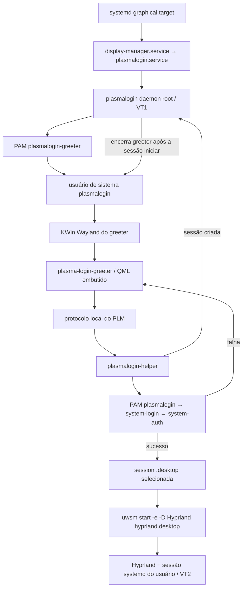

# Nocturne Greeter 0.5 — descoberta da arquitetura de login real

**Estado:** investigação e proposta; nenhuma integração foi implementada.

**Máquina observada:** CachyOS, 27 de setembro de 2026.

**Regra de ativação:** este documento não autoriza trocar o display manager, testar senhas reais ou executar os comandos futuros de recuperação na sessão atual.

## 1. Resumo executivo

O login gráfico instalado é **Plasma Login Manager (PLM) 6.7.4**, iniciado por `display-manager.service`/`plasmalogin.service`. Ele autentica via PAM em um helper próprio, cria uma sessão de usuário e inicia o Hyprland através de **UWSM**. Seu greeter roda como usuário de sistema `plasmalogin` sobre um **KWin Wayland separado**. A sessão Hyprland atual ainda não existia quando a tela de login apareceu.

O Umbra atual é uma aplicação Quickshell dentro da sessão do usuário de desenvolvimento; `PreviewAuthenticator` descarta a senha e simula o resultado. O frontend instalado do PLM carrega QML **embutido** (`qrc:/qt/qml/org/kde/plasma/login/Main.qml`). Não foi encontrada uma interface pública de tema para substituir só esse frontend por uma aplicação Quickshell externa. Há um override de executável do greeter no código upstream, mas está identificado para **test setups**; não é contrato de produção.

**Recomendação condicionada a provas em VM:** manter a UI e o shader, produzir uma variante de execução Quickshell sem recursos de preview, usar `Quickshell.Services.Greetd` para conversar com **greetd** e executá-la como usuário de greeter em um compositor Wayland dedicado. O greetd, não a UI, deve possuir PAM, limites de privilégio e ciclo de vida da sessão. Essa rota exige trocar o display manager **em uma fase futura**; não deve ser ativada no host antes de prova de composição, autenticação, multimonitor, TTY e rollback em VM. SDDM com port da UI para um tema Qt Quick é a principal alternativa se o Quickshell pré-login falhar.

O maior risco imediato é confundir “funciona no Hyprland do usuário” com “funciona antes do login”: compositor, barramento D-Bus de sessão, PipeWire, variáveis, permissões e GPU são diferentes. O maior risco de ativação é um greeter que abre tela preta ou falha no teclado/VT. A recuperação **não pode depender do Umbra**: manter PLM instalado, provar um TTY independente, preservar configurações/pacotes e ensaiar rollback a partir desse TTY ou de boot em `multi-user.target`.

## 2. Stack real encontrada

| Camada | Evidência local | Conclusão |
|---|---|---|
| Distribuição/kernel | `/etc/os-release`; `uname -srmo` | CachyOS Linux rolling; kernel `7.2.8-1-cachyos`, x86-64. |
| Init/target | `/sbin/init` → systemd; `systemctl get-default` | systemd; `graphical.target`. |
| Display manager | alias `display-manager.service`; pacote `plasma-login-manager 6.7.4-3` | `plasmalogin.service`, ativo, `ExecStart=/usr/bin/plasmalogin`. |
| Greeter gráfico | unit de usuário do greeter e journal de boot | O greeter roda sob conta de serviço dedicada, com KWin Wayland em `/usr/lib/plasma-login-greeter`; UID omitido por ser específico da máquina. |
| Sessão atual | `loginctl show-session "$XDG_SESSION_ID"`; processos; env | Sessão gráfica da conta de desenvolvimento: Wayland, Hyprland 0.56.2 via UWSM 0.27.0. |
| Qt/Quickshell | pacotes, `quickshell --version` | Qt 6.11.2; Quickshell 0.3.1. Módulo `Quickshell.Services.Greetd` já presente. |
| PAM e sistema | pacotes e arquivos | PAM 1.7.2; systemd 262; AccountsService, logind, NetworkManager e UPower instalados. |

Não há um launcher adicional entre `display-manager.service` e `plasmalogin.service`: o alias resolve para a unit instalada pelo pacote CachyOS. A unit possui um `ExecStartPre=-udevadm settle --timeout=10`; isso não altera a autoridade do PLM sobre o login. A unit tem `Restart=always`, `StartLimitBurst=2`, `StartLimitIntervalSec=30` e conflita com `getty@tty1`, por isso o TTY de recuperação deve ser outro, por exemplo VT3. Nenhum drop-in local foi encontrado.

Os pacotes PLM e KWin vêm da distribuição; não apareceu `greetd`, Cage ou SDDM instalado/ativo na consulta de pacotes. O pacote chama-se `plasma-login-manager`, não `plasmalogin` — a primeira tentativa de consulta pelo nome curto retornou “package not found”.

## 3. Fluxo do login atual



O journal do boot confirma: o daemon inicia greeter em VT1, o greeter conecta ao daemon, o usuário escolhe `hyprland-uwsm.desktop`, o helper PAM autentica e inicia o UWSM em VT2; depois o greeter é encerrado. O caminho e o nome transitório do socket de autenticação foram observados, mas omitidos aqui por não serem configuração estável.

## 4. Display manager atual

`plasmalogin.service` executa `/usr/bin/plasmalogin` como root. A configuração ativa encontrada em `/etc/plasmalogin.conf` contém somente:

```ini
[Autologin]
Session=plasma
```

O código upstream da versão 6.7.4 só ativa autologin quando **User** não está vazio. Logo, essa escolha de sessão, sozinha, **não configura autologin**. Não foram encontrados `/etc/plasmalogin.conf.d` nem o arquivo `/usr/lib/plasmalogin/defaults.conf` descrito no README upstream. O estado persistido em `/var/lib/plasmalogin` não é legível pelo usuário atual; não inferir preferências dali. Nenhum segredo foi lido.

O daemon abre o display/VT, inicia o greeter como a conta dedicada, expõe a ele um socket local, recebe usuário, senha e sessão selecionada, delega a autenticação a `plasmalogin-helper`, e inicia o comando da sessão sob o usuário autenticado. O frontend atual tem modelos de usuários e sessões e API de energia (`SessionManagement`). O código consultado mostra autenticação por **usuário/senha** enviada ao daemon; o helper lida com conversação PAM. O frontend QML não recebe um fluxo genérico de desafios PAM. A autenticação observada neste boot teve um prompt, mas isso não prova que todas as políticas PAM futuras terão apenas um.

O frontend PLM carrega `Main.qml` embutido em recurso Qt no executável. `PLASMALOGIN_GREETER_EXEC` existe no daemon upstream e é indicado como mecanismo para testes, não como extensão pública mantida. Usar o socket interno do PLM ou substituir seu processo por uma aplicação Quickshell sem API suportada traria acoplamento perigoso a detalhes privados da versão.

Fontes primárias: [README do PLM](https://github.com/KDE/plasma-login-manager/blob/master/README.md), [greeter do daemon 6.7.4](https://raw.githubusercontent.com/KDE/plasma-login-manager/v6.7.4/src/daemon/Greeter.cpp), [entrada do frontend 6.7.4](https://raw.githubusercontent.com/KDE/plasma-login-manager/v6.7.4/src/frontend/greeter/main.cpp), [proxy do frontend 6.7.4](https://raw.githubusercontent.com/KDE/plasma-login-manager/v6.7.4/src/frontend/greeter/backend/GreeterProxy.cpp), [display do daemon 6.7.4](https://raw.githubusercontent.com/KDE/plasma-login-manager/v6.7.4/src/daemon/Display.cpp).

## 5. PAM atual

Os serviços PAM desta instalação estão em `/usr/lib/pam.d/`:

| Serviço | Papel observado | Conteúdo relevante |
|---|---|---|
| `plasmalogin-greeter` | Abrir a sessão **da conta do greeter**, sem pedir senha de usuário | `pam_env`, `pam_permit`, `pam_unix`, `pam_systemd`. |
| `plasmalogin` | Login gráfico de usuário | Inclui `/etc/pam.d/system-login` em auth/account/password/session; integração opcional de keyring/KWallet; `pam_keyinit`. |
| `plasmalogin-autologin` | Caminho opcional, não habilitado pela configuração encontrada | Serviço separado; não implica autologin ativo. |

`system-login` inclui `system-auth`, `pam_loginuid`, `pam_systemd`, `pam_env`, limites e outros módulos de abertura da sessão. `system-auth` inclui `pam_faillock`, `pam_unix` e módulos opcionais como `pam_systemd_home`; mudanças ali afetariam mais que este greeter e estão fora de escopo. O código do `PamBackend` upstream faz `pam_authenticate`, `pam_acct_mgmt`, `pam_setcred` e `pam_open_session`, reúne o ambiente PAM e configura HOME/PWD/SHELL/USER/LOGNAME para o usuário da sessão. **É o helper do PLM que conversa com PAM; o QML não deve fazê-lo.**

Falhas chegam ao frontend pelo protocolo do PLM. Múltiplos prompts, perguntas de MFA, alteração obrigatória de senha, conta expirada e indisponibilidade de backend devem ser tratados no desenho futuro; não tentar simular suporte pleno com um único campo de senha. Não houve teste experimental com credenciais.

Fontes: [PamBackend 6.7.4](https://raw.githubusercontent.com/KDE/plasma-login-manager/v6.7.4/src/helper/backend/PamBackend.cpp), [PamHandle 6.7.4](https://raw.githubusercontent.com/KDE/plasma-login-manager/v6.7.4/src/helper/backend/PamHandle.cpp), além dos arquivos PAM locais listados acima.

## 6. Descoberta e lançamento das sessões

Arquivos locais encontrados em `/usr/share/wayland-sessions/`:

| Arquivo | `Exec` | Uso |
|---|---|---|
| `hyprland-uwsm.desktop` | `uwsm start -e -D Hyprland hyprland.desktop` | Sessão atual; `Name=Hyprland (uwsm-managed)`, `TryExec=uwsm`, `DesktopNames=Hyprland`. |
| `hyprland.desktop` | `/usr/bin/start-hyprland` | Alternativa sem o wrapper UWSM do primeiro arquivo. |
| `plasma.desktop` | `/usr/lib/plasma-dbus-run-session-if-needed /usr/bin/startplasma-wayland` | Plasma Wayland. |

`/usr/share/xsessions/` estava vazio. O modelo de sessões do PLM enumera `.desktop` em caminhos X11 e Wayland padrão, filtra/ordena, e o daemon resolve o nome da sessão antes de iniciar o `Exec`. Para este host, “entrar no Hyprland como hoje” significa preservar o caminho **UWSM** mostrado acima, e não lançar `Hyprland` diretamente por palpite. O PLM define variáveis como `DESKTOP_SESSION`, `XDG_CURRENT_DESKTOP`, `XDG_SESSION_CLASS`, `XDG_SESSION_TYPE`, `XDG_SEAT`, `XDG_VTNR` e `XDG_SESSION_DESKTOP`; PAM e UWSM completam o ambiente.

Na arquitetura futura, o backend deve receber uma **seleção de sessão validada**, baseada em registro administrativamente instalado, e produzir um argv fixo/allowlisted. Não interpolar conteúdo arbitrário do `.desktop` em um shell. A implementação exata da enumeração, expansão de `Exec`, `TryExec` e variáveis precisa ser testada contra a versão futura do backend.

Fontes: [SessionModel do PLM 6.7.4](https://raw.githubusercontent.com/KDE/plasma-login-manager/v6.7.4/src/frontend/settings/models/sessionmodel.cpp), [Session do PLM 6.7.4](https://raw.githubusercontent.com/KDE/plasma-login-manager/v6.7.4/src/common/Session.cpp), [UWSM upstream](https://github.com/Vladimir-csp/uwsm).

## 7. Ambiente gráfico antes do login

O PLM **não** desenha sobre a sessão Hyprland de desenvolvimento. A conta de serviço do PLM tem uma sessão Wayland própria: `startplasma-login-wayland` ativa `plasma-login-wayland.target` no systemd de usuário do greeter; o target vincula `plasma-login-kwin_wayland.service` (KWin com `--no-lockscreen --no-global-shortcuts --no-kactivities`) e `plasma-login.service` (`/usr/lib/plasma-login-greeter`). Há também um serviço de wallpaper. O greeter do usuário de desenvolvimento não pode assumir a existência de `wayland-1`, `DISPLAY=:0` ou do D-Bus da sessão existente nesse contexto.

Quickshell `FloatingWindow` cria uma janela normal de compositor. Portanto, a opção greetd exige **um compositor Wayland dedicado para o greeter**. Cage é um candidato inicial para ensaio em VM, especialmente se uma configuração permitir alternar VT de recuperação; seu comportamento multimonitor precisa ser validado, pois os modos de saída podem espelhar, estender uma única janela ou usar apenas um monitor. Um Hyprland dedicado também seria tecnicamente possível, mas aumenta configuração e superfície de falha antes do login. A escolha do compositor permanece **em aberto** até ensaios reais.

Fontes: [units locais do PLM](#apêndice-a-comandos-de-inspeção-executados), [startplasma-login-wayland upstream](https://raw.githubusercontent.com/KDE/plasma-login-manager/v6.7.4/src/frontend/startkde/startplasmalogin-wayland.cpp), [Quickshell FloatingWindow](https://quickshell.org/docs/v0.3.0/types/Quickshell/FloatingWindow/), [manual do Cage](https://github.com/cage-kiosk/cage/blob/master/cage.1.scd), [configuração do Cage](https://github.com/cage-kiosk/cage/wiki/Configuration).

## 8. Compatibilidade do Umbra e do Quickshell

O runtime de desenvolvimento usa Qt Quick 6.11.2 e Quickshell 0.3.1. Os módulos instalados incluem `Quickshell.Services.Greetd`, `Networking`, `Pipewire`, `UPower` e `Pam`. A presença do módulo **não** prova acesso pré-login ao daemon, compositor ou serviços de sessão. Quickshell 0.3 ainda está sujeito a mudanças de API antes de 1.0; a versão deve ser fixada no pacote de produção e testada na atualização da distribuição.

| Dependência atual | Classificação pré-login | Motivo / ação proposta |
|---|---|---|
| Qt Quick, Quickshell, QSB, SVG, fontes instaladas globalmente (`Adwaita Sans`, `Noto Sans`) | **Safe pre-login em princípio** | Arquivos do sistema estão disponíveis; verificar resolução de plugins/fontconfig e shader no processo real de greeter. |
| GPU/DRM, driver, backend Qt Quick e shader `.qsb` | **Unknown** | O shader funciona hoje no Hyprland do usuário, mas precisa rodar no compositor de greeter e em recuperação sem aceleração ideal. |
| `WAYLAND_DISPLAY=wayland-1`, `DISPLAY=:0`, `XDG_CURRENT_DESKTOP=Hyprland`, `DESKTOP_SESSION`, `$USER`, `$HOME` atuais | **Unavailable pre-login como dados do usuário alvo** | No greeter serão variáveis da conta de serviço/sessão de greeter. Nunca derivar usuário alvo ou sessão selecionada delas. |
| D-Bus de sessão da conta de desenvolvimento, portals, PipeWire/áudio | **Unavailable pre-login** | Uma conta de greeter terá outro barramento; status de áudio deve ser omitido ou explicitamente indisponível sem instalar políticas extras. |
| AccountsService, logind, NetworkManager, UPower no D-Bus de sistema | **Questionable** | Serviços existem hoje; autorização de leitura/ação da conta de greeter e comportamento antes do login precisam ser provados. |
| Relógio de sistema e status de bateria via serviço acessível | **Questionable** | Relógio local costuma funcionar; UPower depende de políticas e hardware. Degradar com discrição. |
| Projeto em `~/.config/nocturne-greeter/`, assets e shader graváveis pela conta de desenvolvimento | **Unavailable as trusted production input** | Não executar QML privilegiado/greeter a partir de arquivos modificáveis por uma conta de usuário. |
| `run-preview.sh`, `NOCTURNE_*`, captura e atalhos debug | **Development only** | Excluir do entrypoint/pacote de produção. |

O Quickshell pode assistir alterações de arquivos de configuração por padrão. Em produção, desabilitar reload dinâmico (`watchFiles: false` ou opção equivalente da versão fixada), fornecer paths imutáveis/administrados e fazer `stateDir`/`cacheDir` pertencerem à conta de greeter, sem importar conteúdo executável dali. Fonte: [Quickshell core v0.3](https://quickshell.org/docs/v0.3.0/types/Quickshell/Quickshell/) e [guia de instalação](https://quickshell.org/docs/v0.3.0/guide/install-setup/).

## 9. Dependências que hoje só funcionam após o login

`GreeterWindow.qml` lê `USER`, `HOSTNAME`, `NOCTURNE_USER_NAME`, `NOCTURNE_CAPTURE_DIR`, tamanho de preview e flag debug; sua `FloatingWindow` usa a primeira tela Quickshell. `SystemChrome.qml` usa serviços Quickshell de rede, PipeWire e UPower e deduz a sessão de `XDG_CURRENT_DESKTOP`/`DESKTOP_SESSION`. `ClockDisplay.qml` usa `SystemClock`; `CosmicScene.qml` carrega QSB local. O preview é lançado por `scripts/run-preview.sh` **dentro** do compositor atual.

Consequência: nome do usuário, avatar, sessão e permissões de áudio/rede precisam ser fornecidos por modelos explícitos de greeter. Status secundário pode sumir sem comprometer o login. Um greeter deve continuar operável se NetworkManager, UPower, portals ou PipeWire não estiverem disponíveis.

## 10. Fronteira atual UI/backend e fronteira proposta

Hoje:

```text
shell.qml → GreeterWindow.qml → AuthPanel.qml
             │                  └─ senha mascarada / submit
             ├─ GreeterController.qml (phases e motion)
             └─ PreviewAuthenticator.qml (timer 360 ms, falha/sucesso fake)
                                    └─ Success até preto, sem iniciar sessão
```

`GreeterController` emite `authenticationRequested(username, secret)` e recebe `rejectAuthentication`/`completePreviewSuccess`. `PreviewAuthenticator` descarta o segredo, aguarda 360 ms e retorna falha; `Ctrl+Enter` usa outro timer para sucesso visual. `AuthPanel` usa `TextInput.Password`, limite de 256 caracteres e limpa o campo no submit. Mas a senha ainda percorre strings QML/JS e um signal; mascaramento **não** garante remoção de memória. Não há senha em logs do projeto observados.

Fronteira desejada em produção:

```text
Componentes visuais + GreeterController (sem PAM, sem shell)
    ↕ eventos tipados: desafio, resposta, erro, pronto, abortar
BackendAdapter abstrato (interface pequena, mock no desenvolvimento)
    ↕ Quickshell.Services.Greetd em produção
Quickshell sem privilégios → daemon greetd privilegiado → PAM → sessão/VT/UWSM
```

O adapter deve encaminhar **desafios tipados**, inclusive prompt oculto e prompt visível, mensagem informativa/erro e cancelamento. A UI não deve assumir que todo login é exatamente “uma senha”. A resposta sensível deve ter tempo de vida mínimo; nenhum signal de telemetria ou log deve receber o valor. Após `readyToLaunch`, iniciar o SUCCESS visual; só quando a tela estiver em **preto absoluto** chamar o lançamento da sessão. A documentação do greetd informa que a sessão começa após o greeter sair; portanto, a tela preta antecede a saída/launch e o backend assume a transição. Se o lançamento falhar, o adapter deve retornar a um caminho recuperável, sem afirmar sucesso ao usuário.

Fontes: [Quickshell Greetd API](https://quickshell.org/docs/v0.3.0/types/Quickshell.Services.Greetd/Greetd/), [GreetdState](https://quickshell.org/docs/v0.3.0/types/Quickshell.Services.Greetd/GreetdState/), [manual de IPC do greetd](https://raw.githubusercontent.com/kennylevinsen/greetd/master/man/greetd-ipc-7.scd).

## 11. Opções arquiteturais consideradas

### A. Manter PLM e portar Umbra para seu frontend

Preserva PLM, PAM, lançamento de sessões, VT, usuários, power e KWin. Exigiria uma extensão oficialmente suportada pela KDE ou um fork/patch do QML embutido e integração com modelos internos. Quickshell `ShellRoot`/`FloatingWindow` não é um tema drop-in. O override de greeter externo visto no código é de testes; o socket é privado. Sem contrato upstream, um fork de pacote PLM teria manutenção cara a cada atualização e risco de quebra antes do login. **Não recomendado com a API atualmente observada.**

### B. SDDM + tema Qt Quick derivado de Umbra

SDDM oferece API/documentação de tema QML, modelos de usuário e sessão, autenticação e ações de energia. É uma rota madura de backend sem PAM próprio, mas implica trocar o DM futuro e **portar** a UI para o ambiente QML do SDDM: os módulos Quickshell e seus serviços não são assumidos disponíveis no theme engine. Shader e design podem ser reaproveitados após prova no backend gráfico do SDDM. É uma boa alternativa se a rota Quickshell/greetd for inviável; a portabilidade deve ser estimada em protótipo isolado. Fonte: [theming oficial do SDDM](https://github.com/sddm/sddm/wiki/Theming), [projeto SDDM](https://github.com/sddm/sddm).

### C. greetd + compositor Wayland dedicado + Quickshell Umbra

greetd mantém PAM, sessão e limites de privilégio. Quickshell já instala cliente Greetd com `createSession`, desafios, `respond`, `cancelSession`, `readyToLaunch` e `launch(argv, environment)`. O visual e boa parte dos componentes podem permanecer. É a melhor correspondência com a identidade e com a separação UI/backend desejada, **se** compositor, entradas, monitores, GPU e recovery passarem em VM. O greetd não fornece por si mesmo widget de usuários/sessões, então será necessário um pequeno serviço/modelo de leitura com allowlist e um pacote estático administrado. O arquivo `default_session` do greetd usa comando interpretado por shell: deve conter somente uma linha fixa, instalada e controlada administrativamente; nunca entrada de QML/usuário. Fontes: [greetd upstream](https://github.com/kennylevinsen/greetd), [configuração oficial](https://raw.githubusercontent.com/kennylevinsen/greetd/master/man/greetd-5.scd), [IPC oficial](https://raw.githubusercontent.com/kennylevinsen/greetd/master/man/greetd-ipc-7.scd).

### D. Backend de autenticação próprio

Rejeitado nesta descoberta. Duplicaria PAM, seat/VT, credenciais, sessão, ambiente e recovery em código privilegiado nosso. Não há evidência de necessidade que compense essa superfície de ataque.

## 12. Tabela comparativa

| Critério | A: PLM com port/fork | B: SDDM com tema | C: greetd + compositor + Quickshell |
|---|---|---|---|
| Compatibilidade do Umbra | Port para QML embutido; Quickshell não é plug-in | Port substancial dos serviços e shell | Alta no QML visual; adapter e entrypoint novos |
| Segurança/PAM | Backend PLM maduro; fork do frontend pode quebrar | Backend SDDM consolidado | Backend greetd consolidado; desafios PAM tipados |
| Código privilegiado nosso | Nenhum, se só frontend | Nenhum | Nenhum |
| Sessão Hyprland/UWSM | Já comprovada neste host | Precisa comprovar seleção/Exec em VM | Precisa allowlist argv e teste UWSM em VM |
| Wayland pré-login | KWin PLM já funcional | Backend/compositor do SDDM precisa validar | Precisamos escolher/testar compositor dedicado |
| Complexidade de implantação | Fork e atualização de pacote PLM | Troca de DM + port de UI | Troca de DM + compositor + pacote da UI |
| Manutenção | Alta sem API pública | Média, API de tema pública | Média, fixar Quickshell/greetd e contrato de adapter |
| Power e enumeração | Modelos PLM já existem | Modelos SDDM disponíveis | Modelos read-only e D-Bus a construir/validar |
| Recovery/lockout | DM atual mantido, mas pacote forkado pode falhar | Risco de troca de DM | Risco de troca de DM e compositor; fallback TTY obrigatório |
| Evolução Nocturne | Restrita ao frontend PLM | Restrita ao theme engine SDDM | Maior controle da UX sem possuir PAM/sessão |

## 13. Arquitetura recomendada

**C como hipótese de engenharia a validar**, não decisão de ativação: greeter de produção Quickshell como conta dedicada sem privilégios; assets e QML de propriedade administrativa; compositor Wayland de greeter; `Quickshell.Services.Greetd` falando com greetd; greetd executando PAM e lançando sessão allowlisted (inicialmente o caminho Hyprland/UWSM já comprovado no PLM). A UI mantém `GreeterController` e animação de sucesso, mas interpreta `readyToLaunch` como “credenciais aceitas, sessão ainda não iniciada”.

Critérios de veto: se houver regressão de teclado/layout, multimonitor, switching VT, GPU/shader, cancelamento de desafios, UWSM ou rollback sem interface, **não ativar**. Se C falhar por limitações do Quickshell/compositor, ensaiar B em VM antes de pensar em backend próprio. A rota A depende de uma API upstream suportada que não foi encontrada na versão instalada.

## 14. Justificativa

C preserva a composição Umbra e usa uma biblioteca de integração Greetd que já está instalada no Quickshell 0.3.1. O protocolo do greetd modela explicitamente desafios PAM, cancelamento e fase “pronto para lançar”, diminuindo o acoplamento da UI a detalhes PAM. O daemon mantém privilégios e ciclo de vida. O custo real dessa escolha está **fora** da autenticação: compositor pré-login, empacotamento seguro, descoberta de usuários/sessões e recovery. Esses pontos são verificáveis em VM e podem invalidar a recomendação sem tocar no host.

## 15. Modelo de segurança

Fronteiras propostas:

1. **root/gerenciador de pacotes** instala configuração de greetd, executável/entrypoint, QML, QSB, fontes necessárias e allowlist de sessões; contas comuns não os escrevem.
2. **conta dedicada de greeter** executa compositor/Quickshell sem shell interativo e sem privilégios PAM. Só acessa socket Greetd autorizado, recursos gráficos e serviços de leitura explicitamente permitidos.
3. **greetd** é o único dono de PAM, credenciais em trânsito para PAM, VT/seat e início da sessão.
4. **usuário autenticado** só recebe sua sessão depois do sucesso backend; `$HOME`, `$USER` e runtime dir são dele, não da conta de greeter.

QML e shaders são código/inputs de processo de login, mesmo sem root. Nunca carregar o projeto pessoal em `~/.config/nocturne-greeter/` em produção. Desabilitar capture/debug/reload, não aceitar caminho de asset via variável de ambiente sem validação e fixar o comando de sessão. A conta do greeter precisa de permissões mínimas para DRM/input via logind/seat; não conceder acesso geral ao home do usuário.

## 16. Threat model básico

| Ameaça | Risco | Mitigação projetada |
|---|---|---|
| Senha em `TextInput`, strings QML/JS, IPC ou dump de crash | Exposição de credencial | Menor tempo de vida, limpar input após resposta, não copiar para propriedades persistentes, desabilitar/restringir core dumps do greeter, revisar API de resposta. Limpeza visual não prova zeroização. |
| Logs de senha ou respostas PAM | Vazamento persistente | Logar somente tipo/resultado/latência; nunca valor de prompt, buffer, raw IPC, env sensível. |
| Socket IPC mal exposto | Processo indevido inicia auth/sessão | Usar permissões e lifecycle padrão do greetd; não publicar socket em caminho acessível indevidamente; testar ownership. |
| QML/shader/asset gravável pelo usuário | Troca de código da tela de login, phishing/execução sob conta de greeter | Instalação administrada, hashes/pacote, sem live reload, diretórios não graváveis por contas comuns. |
| `Exec` de sessão ou avatar/path malicioso | Comando arbitrário, path traversal, dados manipulados | Allowlist de IDs/argv; nunca shell interpolado; tratar avatar como dado com fallback e limites de caminho/tamanho. |
| Variáveis de ambiente herdadas | Plugin/path injection, uso do usuário errado | Ambiente mínimo e explicitamente construído para greeter/sessão; ignorar `$USER`/`$HOME` como identidade alvo. |
| Falha gráfica/greeter em loop | Lockout visual/teclado | TTY independente, fallback greeter, restart limitado, rollback offline, ensaio em VM. |
| Prompts PAM não suportados | Login bloqueado ou informação errada | Adapter tipado, suporte a visível/oculto/erro/info/cancelamento; testes de MFA/conta expirada quando aplicável. |
| Ação power exposta sem autorização | Desligamento da máquina por usuário não autenticado | Não habilitar até auditar política polkit/logind; chamar API institucional, sem shell/sudo. |

## 17. Layout de filesystem de produção proposto

**Proposta, não criada nesta fase:**

```text
/usr/share/nocturne-greeter/          QML, QSB, SVG e assets; root:root, somente leitura para greeter
/usr/lib/nocturne-greeter/            entrypoint estático/adapter empacotado, se necessário
/etc/nocturne-greeter/                política pequena: sessão permitida, fallback, opções explícitas
/var/lib/nocturne-greeter/            estado mínimo da conta greeter, nunca QML executável
/var/cache/nocturne-greeter/          cache descartável da conta greeter
/etc/greetd/config.toml              configuração do backend, administrada e com comando fixo
```

Os caminhos e owners exatos dependem do pacote/serviço escolhido na fase de implementação. Evitar cópia ad hoc para `/usr` sem pacote e sem manifesto de rollback. A configuração de greetd deve apontar para uma invocação fixa do compositor e do Quickshell. `~/.config/nocturne-greeter/` permanece **somente desenvolvimento**.

## 18. Development vs production

| Desenvolvimento atual | Produção futura |
|---|---|
| `scripts/run-preview.sh`, conta de desenvolvimento, compositor Hyprland existente | Serviço de greeter/conta dedicada/compositor pré-login |
| `PreviewAuthenticator`, timers e falha fake | Adapter Greetd; respostas reais apenas via backend consolidado |
| `Ctrl+Enter` sucesso visual, `Ctrl+Q`, `NOCTURNE_DEBUG` | Atalhos de preview ausentes do build/entrypoint; saída controlada pelo backend |
| `PreviewCapture`, `NOCTURNE_CAPTURE_DIR`, screenshots | Código de captura excluído do pacote de produção |
| Assets/QML graváveis pelo usuário | Root-owned e versionados em pacote; reload dinâmico desligado |
| `$USER`, `$HOME`, `XDG_CURRENT_DESKTOP` do usuário logado | Identidade/sessão modeladas explicitamente, nunca herdadas |

Evitar uma única flag runtime que possa acidentalmente reativar sucesso falso. Preferir **entrypoints e artefatos separados**: pacote de produção não contém `PreviewAuthenticator.qml`, `PreviewCapture.qml` nem handler `Ctrl+Enter`; um teste de empacotamento deve falhar se qualquer um estiver presente. O mesmo `GreeterController` visual pode ser compartilhado com uma interface de backend pequena e mock para testes.

## 19. Recovery strategy obrigatório

Antes de qualquer troca futura no host:

1. Provar login em **VT3/TTY** e retorno à sessão atual em ambiente de teste, inclusive com greeter preto. PLM ocupa/conflita com tty1. Confirmar teclado/layout e credenciais em TTY sem passar pelo Umbra.
2. Manter PLM e seus pacotes instalados; registrar versão, hashes de configuração, unit/alias `display-manager.service`, arquivos PAM, cache de pacotes e configuração original. Não sobrescrever PAM.
3. Manter fallback independente, por exemplo `agreety` como sessão de emergência do greetd ou retorno a PLM, configurado/testado em VM. Ele precisa ser selecionável a partir do TTY, sem clicar no Umbra.
4. Limitar tentativas automáticas de reinício e registrar falhas no journal; um processo que abre mas não desenha não será curado só por `Restart=always`.
5. Se a superfície gráfica/VT falhar, ter caminho de boot para `systemd.unit=multi-user.target`; se nem isso funcionar, mídia de resgate/chroot e manifesto de rollback.

**Procedimento futuro específico para a hipótese greetd, NÃO EXECUTADO:** sair da tela preta com `Ctrl+Alt+F3`, fazer login de administrador no TTY (sem passar pelo Umbra) e, depois de confirmar que a unit nova se chama `greetd.service`, executar nesta ordem:

```bash
systemctl stop greetd.service
systemctl disable greetd.service
systemctl enable --force plasmalogin.service
systemctl start plasmalogin.service
systemctl status display-manager.service plasmalogin.service --no-pager
```

O `enable --force` devolve o alias `display-manager.service` ao PLM, caso greetd o tenha tomado. O operador deve conferir em `systemctl cat display-manager.service` que o alvo voltou a ser `/usr/lib/systemd/system/plasmalogin.service`, verificar a tela PLM em VT1 e testar login. O procedimento e os nomes das units devem ser **revalidados com o pacote greetd realmente escolhido e ensaiados em VM**. Se VT3 não abrir, usar o menu do bootloader para iniciar com `systemd.unit=multi-user.target` e executar o mesmo rollback a partir do terminal; mídia de resgate/chroot é o terceiro caminho. Um greeter em tela preta não pode ser o único acesso à operação de recovery.

## 20. Rollback como transação futura

```text
PRECHECK (VM, TTY, teclado, usuário de teste, pacotes, GPU, monitores)
  → BACKUP (config/unit/alias/PAM somente cópia, versões e hashes)
  → INSTALL (pacote root-owned, PLM preservado)
  → VALIDATE (QML/QSB, permissões, greeter em VM, UWSM, fallback)
  → ENABLE (janela de manutenção, operador presente no TTY)
  → TEST (credenciais de teste, sessão, VT, reboot planejado em fase futura)
  → COMMIT (só após ciclos completos de login/recovery)
qualquer falha → ROLLBACK documentado e ensaiado a partir do TTY
```

O backup deve incluir o destino real do alias `display-manager.service` e configurações de ambas as units. A instalação do pacote não deve destruir PLM. Diferenciar falha de UI (compositor/Quickshell) de falha de backend (greetd/PAM) no journal. A ativação deve ocorrer apenas quando um operador puder usar TTY e, idealmente, console fora de banda ou mídia de resgate.

## 21. Logging seguro

Journal estruturado por serviço para: início e versão do pacote, resolução de QML/QSB/fontes, conexão/desconexão Greetd, transição de fase **sem dados sensíveis**, tipo de desafio, cancelamento, resultado de auth, ID da sessão allowlisted, falha de lançamento e shutdown do greeter. Registrar timestamps para correlacionar animação de SUCCESS e `launch`; limitar repetição de erros do shader. **Nunca** registrar senha, resposta PAM, conteúdo de `TextInput`, payload bruto do IPC, env completo ou socket sensível. Minimizar/mascarar username quando possível e restringir leitura de logs. Considerar desabilitar core dumps do processo de greeter porque memória QML pode conter credenciais.

## 22. Power actions

No PLM atual, o frontend usa `SessionManagement` para expor disponibilidade e ações de desligar/reiniciar/suspender. Em uma arquitetura greetd, não executar `shutdown`, `reboot`, `systemctl poweroff` ou shell a partir de QML. Uma integração futura deve consultar `org.freedesktop.login1.Manager` (`CanPowerOff`, `CanReboot`, `CanSuspend`) e acionar métodos via D-Bus **somente** após revisar políticas polkit da conta greeter. A disponibilidade e a autorização podem ser diferentes antes do login. Manter os botões desabilitados enquanto isso não for provado em VM. Fonte: [interface oficial login1](https://github.com/systemd/systemd/blob/main/man/org.freedesktop.login1.xml).

## 23. Descoberta de usuário, avatar e sessão

PLM possui `UserModel` e `SessionModel` próprios. Em greetd, o protocolo de auth não é um catálogo de usuários/sessões. Proposta: fonte de usuários via **AccountsService** no D-Bus de sistema, com fallback manual e filtro explícito para contas apropriadas; validar display name/avatar como dados externos e permitir username digitado para contas não enumeradas. `USER`/`HOME` do greeter **não** representam a pessoa que entra. Não usar avatar de path arbitrário sem checar ownership, limites e fallback. Fonte: [API oficial AccountsService](https://cgit.freedesktop.org/accountsservice/tree/data/org.freedesktop.Accounts.xml).

Sessões: ler `.desktop` instalados em `/usr/share/wayland-sessions`/`xsessions`, respeitar `TryExec`, oferecer apenas IDs permitidos e mapear a seleção a um argv explícito. A opção inicial deve ser `hyprland-uwsm.desktop` para reproduzir o caminho comprovado; regra de sessão default/última sessão e onde guardar essa preferência exigem especificação. Layout de teclado pré-login deve ser aplicado pelo compositor/seat do greeter e sincronizado com a apresentação da UI; não presumir layout do Hyprland do usuário.

## 24. Estratégia de testes

| Ambiente | O que valida | O que **não** prova |
|---|---|---|
| Mock backend/QML tests | Estados, foco, desafios tipados, cancelamento, senha limpa, SUCCESS/black, sem atalhos preview no pacote | PAM, VT, logind e sessão real. |
| Compositor Wayland aninhado dentro da sessão atual | Render, shader, foco, mouse, escala e parte do multimonitor | DRM/seat, permissões/DBus pré-login, troca de VT. |
| Container | Build, empacotamento, ownership, manifests, contratos de IPC com fake | GPU/DRM e login gráfico real. |
| VM com snapshot e usuário de teste | Greetd/PAM, compositor, UWSM, sessão, falha do greeter, TTY, rollback e package upgrade | Todos os drivers/monitores/GPU do host. |
| Máquina reserva ou janela de manutenção do host, **fase separada** | Hardware real e recovery final | Não deve ser o primeiro experimento. |

Injetar falhas deliberadas na VM: QML inválido, QSB ausente, shader sem aceleração, compositor que não abre, greetd sem conexão, prompt visível/oculto, senha errada, conta expirada, sessão `.desktop` ausente, UWSM falhando, multimonitor e keyboard layout. Provar que VT3 e rollback continuam acessíveis em cada caso. Testar que a animação termina em preto **antes** de `launch()` e que falha no lançamento retorna ao greeter/fallback.

## 25. Riscos desconhecidos

- Cage e greetd não estão instalados neste host; versões, configuração e comportamento real ainda não foram testados.
- Acesso do usuário de greeter a `AccountsService`, NetworkManager, UPower e logind requer prova de D-Bus/polkit; PipeWire de sessão provavelmente não existe para ele.
- Compatibilidade GPU/QSB/KWin/Cage, tela ultrawide, múltiplos outputs e high DPI antes do login é desconhecida.
- `Quickshell.Services.Greetd` está instalado, mas seu fluxo de cancelamento/lançamento e saída após sucesso precisa ser testado contra versão concreta do greetd.
- A política PAM real pode mudar; prompts multifator e expiração não foram exercitados.
- `/var/lib/plasmalogin` não pôde ser inspecionado sem privilégios; seleção de última sessão/usuário persistida permanece desconhecida.
- Não foi demonstrado TTY/recovery nesta investigação, pois isso poderia interferir na sessão atual.
- Dados de FPS/RAM do preview não predizem consumo do compositor dedicado pré-login.

## 26. Perguntas antes da implementação

1. Qual compositor de greeter oferece melhor equilíbrio de multimonitor, foco, layout de teclado, VT e facilidade de recovery para esta GPU? Cage serve após ensaio ou é necessário outro?
2. Qual versão concreta de greetd e quais políticas de seat/PAM o pacote da distribuição fornece? O serviço Greetd de Quickshell 0.3.1 funciona com ela?
3. Como definir/guardar sessão default e permitir outras sessões sem interpretar `Exec` arbitrário?
4. Quais prompts PAM precisam ser suportados nesta máquina (MFA, `pam_systemd_home`, password change, unlock)?
5. Qual fonte de usuários e avatares é aceitável antes do login, e qual fallback manual evita lockout?
6. Quais operações D-Bus read-only e power a conta de greeter pode realizar sob as políticas atuais?
7. O QSB atual desenha corretamente no compositor pré-login, inclusive em fallback gráfico e em todos os monitores?
8. Qual é o mecanismo exato de fallback greeter/PLM no pacote futuro e como o operador o invoca em VT3?
9. Como a versão de Quickshell/greetd será fixada ou validada antes de updates rolling do CachyOS?
10. O objetivo de produto aceita exigir troca de DM? Se não, é preferível investir em port SDDM/PLM com interface upstream suportada?

## 27. Roadmap incremental sugerido

1. **Contrato de backend, sem PAM:** especificar interface mock ↔ UI, prompts tipados, cancelamento, `readyToLaunch`, falhas; excluir fake success no pacote de produção por construção.
2. **PoC em VM com snapshot:** instalar versões concretas greetd/compositor/Quickshell ali, sem tocar no host; criar usuário de greeter, artefatos root-owned e fallback TTY.
3. **Primeiro login de teste em VM:** teclado, prompts, user/session model, `hyprland-uwsm.desktop`, sessão, logind e saída do greeter após preto.
4. **Falhas/recovery em VM:** QML/shader/backend/compositor, TTY, greeter fallback, rollback de pacote/unit e novo boot.
5. **Portabilidade da produção:** remover ferramentas de preview, definir manifesto de arquivos/owners, assinaturas/hashes, logging e testes de pacote; medir recursos do compositor pré-login.
6. **Gate de arquitetura:** escolher C ou migrar a B com base nas provas. Só então elaborar plano de ativação específico para o host.
7. **Ativação futura separada:** com consentimento explícito, manutenção assistida, backup verificável e TTY/rollback demonstrados; nunca como continuação automática desta fase.

## Apêndice A — comandos de inspeção executados

Todos os comandos abaixo foram de leitura. Os comandos de consulta ao projeto e de pesquisa de código upstream são separados para distinguir claramente inspeção da máquina, leitura do protótipo e documentação. A tentativa de `plasmalogin --version` ficou aguardando como processo de teste e foi interrompida com `Ctrl+C` **somente nesse processo**; a unit original permaneceu ativa, no PID original e com `NRestarts=0`. A consulta `cat /usr/bin/startplasma-login-wayland` leu um ELF, gerou saída inútil e não alterou arquivos.

### Estado da máquina, pacotes, sessão e configuração

```bash
cat /etc/os-release
uname -srmo
readlink -f /sbin/init
env | rg '^(XDG_SESSION_ID|XDG_SESSION_TYPE|XDG_CURRENT_DESKTOP|DESKTOP_SESSION|WAYLAND_DISPLAY|DISPLAY|USER|LOGNAME|XDG_RUNTIME_DIR)='
systemctl show display-manager.service -p Id -p Names -p FragmentPath -p DropInPaths -p ExecStart -p MainPID -p ActiveState -p SubState -p UnitFileState -p WantedBy
systemctl cat display-manager.service
loginctl list-sessions --no-legend
ps -eo pid,ppid,user,comm,args | rg -i 'plasmalogin|sddm|greetd|lightdm|quickshell|hyprland|kwin_wayland|weston|seatd|display.manager'
loginctl show-session "$XDG_SESSION_ID" -p Leader -p Service -p Type -p Desktop -p Class -p State -p Seat -p TTY -p Remote -p Display -p Name -p User -p Scope -p VTNr
pacman -Q | rg '^(plasmalogin|sddm|greetd|quickshell|qt6-|uwsm|hyprland|pam |systemd |accountsservice|pipewire|networkmanager|upower|polkit|kwin|kde)'
pacman -Ql plasmalogin
rg --files /etc/pam.d /usr/share/wayland-sessions /usr/share/xsessions /etc/plasmalogin.conf.d /usr/lib/plasmalogin 2>/dev/null
systemctl get-default
pacman -Qo /usr/bin/plasmalogin /usr/lib/systemd/system/plasmalogin.service /usr/lib/plasmalogin-helper
pacman -Q | rg -i '(^|[- ])(plasma-login|login|sddm|greetd|cage|weston|kwin)'
rg --files /usr/lib/pam.d /usr/share/plasmalogin /etc | rg '(pam.d|plasmalogin|login\.conf|wayland-sessions|xsessions)'
cat /usr/share/wayland-sessions/hyprland-uwsm.desktop /usr/share/wayland-sessions/hyprland.desktop /usr/share/wayland-sessions/plasma.desktop
ls -la /etc/plasmalogin.conf /etc/plasmalogin.conf.d /usr/lib/pam.d /usr/share/plasmalogin 2>&1
pacman -Ql plasma-login-manager
cat /etc/plasmalogin.conf /usr/lib/pam.d/plasmalogin /usr/lib/pam.d/plasmalogin-greeter /usr/lib/pam.d/plasmalogin-autologin /etc/pam.d/system-login /etc/pam.d/system-local-login /etc/pam.d/system-auth /usr/lib/pam.d/kde
man -P cat plasmalogin
man -P cat plasmalogin.conf
quickshell --version
plasmalogin --version
pacman -Qi plasma-login-manager
cat /usr/share/plasmalogin/scripts/wayland-session /usr/share/plasmalogin/scripts/Xsession
pacman -Ql plasma-workspace | rg -i '(login|greeter|lookandfeel|sddm)'
cat /usr/lib/systemd/user/plasma-login.service /usr/lib/systemd/user/plasma-login-kwin_wayland.service /usr/lib/systemd/user/plasma-login-wayland.target /usr/lib/systemd/user/plasma-wallpaper.service /usr/lib/sysusers.d/plasmalogin.conf /usr/lib/tmpfiles.d/plasmalogin.conf
cat /usr/bin/startplasma-login-wayland
rg -n '^(\[|[A-Za-z]+\s*=)' /etc/plasmalogin.conf
ls -la /usr/lib/plasmalogin /var/lib/plasmalogin /usr/share/wayland-sessions /usr/share/xsessions 2>&1
getent passwd plasmalogin
pgrep -a plasmalogin
systemctl show plasmalogin.service -p FragmentPath -p ExecStart -p MainPID -p ActiveState -p NRestarts -p Restart -p StartLimitBurst -p StartLimitIntervalUSec
journalctl -b -u plasmalogin.service --no-pager -o short-iso -n 80
ls -la /usr/lib/plasmalogin/defaults.conf /usr/share/plasma/look-and-feel /usr/share/plasma-login 2>&1
pacman -Ql plasma-workspace | rg '(org.kde.breeze.desktop|login|greeter|lookandfeel)' | head -n 80
pacman -Ql quickshell | rg '(Greetd|Networking|Pipewire|UPower|Pam)'
pacman -Q qt6-base qt6-declarative qt6-wayland qt6-shadertools qt6-svg kwin plasma-workspace quickshell
busctl --system list --no-pager | rg '(Accounts|UPower|NetworkManager|login1|PolicyKit)'
busctl --user list --no-pager | rg '(PipeWire|pipewire|portal|org.kde.KWin|systemd1)'
fc-match 'Adwaita Sans' && fc-match 'Noto Sans'
ls -ld "$HOME/.config/nocturne-greeter" "$HOME/.config/nocturne-greeter/shaders" "$HOME/.config/nocturne-greeter/assets" /usr/lib/qt6/qml/Quickshell/Services/Greetd 2>&1
systemctl show display-manager.service -p FragmentPath -p MainPID -p ActiveState -p SubState -p NRestarts
```

A consulta às units de usuário PLM foi executada duas vezes com os mesmos argumentos; a listagem de pacotes `plasma-workspace` foi refinada uma segunda vez. `man` não encontrou página local para `plasmalogin`/`plasmalogin.conf`. `rg` em `/etc` reportou acesso negado a alguns diretórios não relacionados; nenhum privilégio adicional foi solicitado.

### Código local lido

```bash
rg --files . | sort
rg -n '^(import|property|signal|function|[[:space:]]*(GreeterController|PreviewAuthenticator|GreeterWindow|AuthPanel|CosmicScene|SystemChrome)|[[:space:]]*Connections)' shell.qml components/*.qml
cat README.md PRODUCT.md DESIGN.md
cat scripts/run-preview.sh
cat shell.qml components/GreeterController.qml components/PreviewAuthenticator.qml
cat components/GreeterWindow.qml
cat components/AuthPanel.qml
cat components/SystemChrome.qml components/ClockDisplay.qml
cat components/CosmicScene.qml components/PreviewCapture.qml
sed -n '1,280p' components/AuthPanel.qml
sed -n '1,280p' components/SystemChrome.qml
sed -n '1,180p' components/CosmicScene.qml
rg -n '^(import|\s*function|\s*property|\s*signal|\s*on[A-Za-z]+:)' components/ClockDisplay.qml components/PreviewCapture.qml
git status --short
cat components/ClockDisplay.qml
ls -la docs
sed -n '1,220p' components/GreeterController.qml
sed -n '1,180p' components/PreviewAuthenticator.qml
sed -n '1,200p' components/GreeterWindow.qml
wc -l docs/REAL_LOGIN_ARCHITECTURE_0.5.md
rg -n '^## ' docs/REAL_LOGIN_ARCHITECTURE_0.5.md
find . -type f -newermt '2026-09-27 18:46:00 UTC' -printf '%p\n' | sort
rg -n 'sudo|Ctrl\+Enter|systemctl (stop|disable|enable|start)' docs/REAL_LOGIN_ARCHITECTURE_0.5.md
```

Este diretório não é um repositório Git; `git status --short` informou isso. Os snapshots existentes não foram alterados.

### Consulta de árvores upstream por API pública

```bash
curl -fsSL 'https://api.github.com/repos/KDE/plasma-login-manager/git/trees/master?recursive=1' | python3 -c 'import json,sys; d=json.load(sys.stdin); print("\n".join(x["path"] for x in d["tree"] if any(s in x["path"].lower() for s in ("greeter", "theme", "backend", "session", "pam", "wayland"))))'
curl -fsSL 'https://api.github.com/repos/KDE/plasma-login-manager/git/trees/v6.7.4?recursive=1' | python3 -c 'import json,sys; d=json.load(sys.stdin); print("\n".join(x["path"] for x in d["tree"] if x["path"].startswith(("src/frontend", "src/daemon", "src/helper", "services", "data")) and x["type"]=="blob" and any(s in x["path"].lower() for s in ("config", "model", "session", "display", "power", "user", "auth", "main.cpp", "service.in", "startkde"))))'
curl -fsSL 'https://api.github.com/repos/kennylevinsen/greetd/git/trees/master?recursive=1' | python3 -c 'import json,sys; d=json.load(sys.stdin); print("\n".join(x["path"] for x in d["tree"] if x["path"].startswith(("man/","greetd_ipc/"))))'
```

Outras leituras da documentação e dos arquivos upstream citados nas seções foram feitas por acesso web, sem escrita local. Nenhum comando de alteração do display manager, PAM, units, pacotes, boot ou energia foi executado.
