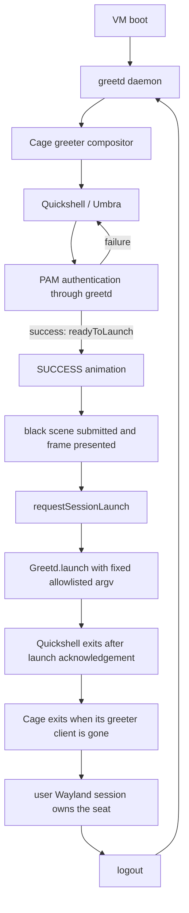

# Nocturne Greeter 0.8 — Real Login Integration in VM

**STATUS: PREPARATION ONLY**

**Last checked:** 2026-10-01

**Scope:** prepare a disposable VM experiment. No real greetd/PAM login was run.

## Proof status

### PROVEN

- The 0.7 branch was merged to `main` by PR #1 (`d245b7a`); the local `main`
  was fast-forwarded to that remote merge commit.
- The 0.7 QML suite passed **37/37** tests.
- All **nine** Quickshell Greetd API / local IPC fixture scenarios passed.
  They covered success, failure, retry, multiple prompts, visible prompts,
  informational/error messages, cancellation, and a late message after cancel.
- Every fixture run reported `start_session=0`; the fixture cannot execute a
  session command and does not call PAM.
- `qmllint`, `bash -n`, QSB rebuild, GLSL validation, staging and staged
  SHA-256 verification passed. The nested harness started and cleaned up its
  compositor, client, fixture and temporary runtime.
- The repository scan found no credential-shaped token, password assignment,
  host home path, machine-id/runtime file, or protocol canary in the logs.

### PREPARED

- A fail-closed VM guard and nine fixture-based guard tests were added.
- The VM, recovery, compositor and session-launch plan below is ready for a
  guest with a console and snapshot support.
- The launch lifecycle is specified, while the 0.7 launch barrier remains
  unchanged.

### NOT PROVEN

- No VM is available in the current environment. No daemon greetd, real PAM,
  test account, real seat/DRM ownership, input device, session launch, logout
  cycle, failure recovery or boot-to-greeter was exercised.
- No real password was entered. The mock and IPC fixture results remain
  simulated authentication.
- Results from the nested harness do not establish behavior on a pre-login
  seat or on the host's physical GPU and monitors.

## Environment checked

This workspace is on the physical host, not inside a guest. On 2026-10-01:

- `systemd-detect-virt` and `systemd-detect-virt --vm` reported no
  virtualization. DMI reported a physical motherboard product string.
- The host is CachyOS on systemd 262. `systemd-vmspawn` is installed and
  `/dev/kvm` exists, but `qemu-system-x86_64`, `qemu-img`, `virt-install`,
  `virt-manager`, and VirtualBox tools were not found. `libvirtd` and
  `virtqemud` were inactive.
- `/var/lib/machines` was not readable by the workspace user, so that location
  was not treated as an inventory. No VM was started or created.

**Decision:** stop before installing a hypervisor or creating a guest. The
current host is not the test target. A suitable, disposable VM must be made
available separately.

## Recommended VM

Use a clean **Arch Linux x86-64** guest. This matches the existing CachyOS/Arch
Quickshell stack and current 0.7 API version. The Arch package database
currently lists `greetd 0.10.3-2`, `cage 0.3.1-1`, and `quickshell 0.3.1-1`;
recheck and record installed versions inside the guest immediately before the
experiment because Arch is rolling.

| Setting | Recommendation |
| --- | --- |
| Hypervisor | QEMU/KVM with hardware acceleration. No usable QEMU executable was found on the host during this preparation. |
| Guest OS | Minimal Arch Linux x86-64 install; no host dotfiles or copied desktop configuration. |
| CPU / RAM | 4 vCPU, 6 GiB RAM (8 GiB if available). |
| Disk | 40 GiB dynamically allocated qcow2 image; keep the VM and snapshots outside the Git repository. |
| Firmware | UEFI/OVMF; keep NVRAM state with the VM so boot tests are repeatable. |
| Virtual GPU | Virtio-GPU with virgl/3D enabled when the hypervisor supports it; one 1280×720 output first. Record Qt Quick renderer warnings. |
| Console / recovery | Keep the hypervisor's graphical and serial console available. Reserve a second guest TTY (for example VT3) and prove switching before testing greetd. |
| Network | NAT only while installing/updating packages. No inbound forwarding, host folder mounts, host user binding, or host credential forwarding. Disconnect the guest NIC for authentication/session tests after packages are installed. |
| Snapshots | Save a clean baseline before greetd; save again after standalone greetd/PAM proof; save immediately before changing the guest boot target. Preserve a known-good console recovery snapshot. |
| Test identity | Create one disposable guest user with a temporary local name. Set a unique random password interactively inside the guest; never reuse a host credential or write it to shell history, the repository, screenshots, or logs. |

The currently installed `systemd-vmspawn` supports qcow2 images, KVM, CPU/RAM
settings, ephemeral runs, UEFI selection and guest consoles, but it is not
usable here without a QEMU backend. If the eventual VM frontend cannot provide
virgl, keep the VM and still run the login/recovery tests; record the renderer
limitation rather than treating the guest as an RTX benchmark.

## VM guard

`scripts/real-login-vm-guard.py` accepts only a KVM/QEMU guest with all of these
signals:

1. `systemd-detect-virt --vm` returns `kvm` or `qemu`.
2. DMI vendor/product identifies QEMU.
3. `/proc/cpuinfo` exposes the `hypervisor` CPU flag.
4. A root-owned, non-symlink marker exists at
   `/etc/nocturne-greeter/real-login-vm-0.8` and contains the exact phase marker.
5. The operator supplies `--confirm-real-login-vm`.

The only write mode in the guard bootstraps that marker. It checks the first
three VM signals and explicit confirmation before checking root privileges or
writing anything. On the current host the identity checks fail, so marker
creation cannot proceed. There are no greetd/PAM/systemd installer scripts in
this preparation branch.

After a VM has been provisioned, boot it to its own console, verify that it is
the intended disposable guest, copy/clone the project **inside the guest**
(do not bind the host checkout), and run there:

```sh
sudo ./scripts/real-login-vm-guard.py --bootstrap --confirm-real-login-vm
./scripts/real-login-vm-guard.py --check --confirm-real-login-vm
```

Any future script that changes the guest's greetd, PAM, systemd, boot, TTY or
seat must call the `--check` operation before its first write and require the
same explicit confirmation. Failed checks must abort without falling back to
the host. `--bootstrap --dry-run --confirm-real-login-vm` checks guest identity
without writing the marker.

The guard's unit tests use synthetic QEMU/physical-host evidence. They do not
pretend that a test fixture is a VM and do not perform a privileged action.

## Compositor decision

**Initial candidate: Cage.** Umbra needs one fullscreen Wayland client at
pre-login. Cage is a kiosk compositor designed to display one maximized
application, accepts an application command, supports keyboard/pointer input,
and has a KMS/DRM path when run on a TTY. That makes it a smaller first seat
test than launching a complete desktop compositor. Cage supports multiple
outputs but does not provide output-layout configuration; begin with one
output, then explicitly test its multi-output behavior.

| Candidate | Use in this phase |
| --- | --- |
| Cage | Recommended first VM test. Small single-app surface; DRM/seat, Quickshell, keyboard layout, fullscreen and recovery still require direct proof. |
| KWin | Strong Qt compatibility and already used by the host's existing greeter, but large and dependency-heavy. Keep it as a diagnostic fallback if Cage exposes a Qt Wayland issue. KWin nested remains only a harness. |
| Weston | Stable reference compositor with useful diagnostics; more general configuration than needed for the first kiosk proof. Useful fallback if seat/backend diagnosis is needed. |
| Hyprland | Do not start with it. It adds session/configuration complexity and makes it harder to isolate the greeter lifecycle. Test a minimal Hyprland/UWSM session only after the small Wayland session loops correctly. |

Potential guest command, to be tested and adjusted only inside the VM:

```toml
[default_session]
command = "cage -s -- /usr/bin/quickshell --path /usr/share/nocturne-greeter"
user = "greeter"
```

Treat this as a plan, not an installed configuration. Check Cage's installed
manual, the packaged greeter account, seat access, `GREETD_SOCK`, environment,
socket permissions and actual fullscreen output before changing the guest's
boot behavior. Do not add `greeter` to broad groups as a workaround; grant only
the access proven necessary through the seat/session provider.

## Staged files and ownership

The 0.7 `production-root/` is a local staging tree, not an installed package.
In the guest, install the verified QML, SVG and QSB files under
`/usr/share/nocturne-greeter` with root ownership and read-only permissions for
the greeter. Do not use a developer's or test user's home/config as an asset
source. Quickshell, Cage and the Umbra frontend must run as the
unprivileged `greeter` service identity. The greetd daemon and PAM helpers are
owned by the distribution's service configuration; record their actual UID,
group, executable, unit, restart policy and socket owner/mode from the guest.

Use the distribution's packaged `/etc/pam.d/greetd` unchanged for the first
real authentication proof. Record its path and checksum in the VM report, but
do not commit host-specific PAM contents. Do not add MFA, fingerprint, keyring
or other PAM modules during the first test.

## Staged execution plan

Keep checkpoints separate so a failure has a known recovery point.

1. **Guest baseline:** install minimal Arch, create a VM-only user with an
   exclusive password, prove graphical and serial/TTY console access, save
   snapshot `baseline-no-greetd`.
2. **Inventory:** record Arch release, kernel, Qt, Quickshell, greetd, Cage,
   PAM, unit files, greetd service user/group, PAM service, socket path and
   permissions. Keep PLM and personal sessions out of this guest.
3. **greetd by itself:** use the packaged text greeter (`agreety`) on a guest
   TTY. Start it manually from the guest console before enabling it at boot.
   Check correct password, incorrect password, blank input, retry and logout
   using only the disposable user. Confirm return to the text greeter.
4. **Seat/compositor probe:** start Cage from a guest TTY as the packaged
   greeter identity with a trivial Wayland client. Prove keyboard, pointer,
   VT switching and console recovery before connecting Umbra.
5. **Umbra pre-login:** install the root-owned staging tree; configure greetd
   to run Cage + Quickshell as `greeter`; keep packaged PAM and session defaults.
   Prove focus, first key, visible/secret prompt mode, Backspace, Enter, Escape,
   mouse submit, incorrect-password FAILURE, retry and correct-password
   SUCCESS. Use a fresh guest-only canary and do not record its value.
6. **Session launch:** allow only one fixed test command in the VM build:
   `[/usr/bin/cage, --, /usr/bin/foot, -e, /usr/bin/sh]`. This creates a real
   user Wayland compositor (`cage`) and terminal client (`foot`) without
   importing personal desktop files or evaluating a user-provided shell
   string. Type `exit` to log out. Do not offer general session selection in
   the first test.
7. **Cycles:** run at least three complete login → Wayland session → logout →
   Umbra cycles. Check process lists between cycles and ensure no old Cage,
   Quickshell or test-session processes remain.
8. **Failure injection:** snapshot first, then test a bad QML copy, absent QSB,
   Quickshell startup failure, compositor exit, an immediately exiting test
   session, greetd restart and incorrect credentials. Keep the recovery
   console open; record whether greetd restarts, whether a loop occurs, what
   the logs say and whether recovery needs the snapshot.
9. **Boot proof:** only after the manual loop succeeds, save a snapshot and
   enable the guest's greetd boot path. Reboot twice through Umbra → PAM →
   session and confirm recovery TTY remains usable.
10. **Optional second session:** test a simple Hyprland/UWSM installation only
    after the minimal Cage session and three logout cycles pass. Do not copy a
    host dotfile or enable host services.

### SUCCESS / black / launch contract

The real launch path must remain separate from 0.7 and be introduced only in
the VM-specific frontend:



Do not launch when `successProgress` merely approaches 1. Wait until the
SUCCESS animation has completed, the background-only black frame has actually
been submitted/presented, and the launch request still belongs to the active
authentication generation. Then send one fixed argv/environment allowlist to
`Greetd.launch(..., quit=true)`. Never make a shell command from the username,
password, session label or `.desktop` contents.

The greetd IPC contract says the requested session starts after the greeter
process terminates. Verify the observed Quickshell → Cage → greetd process
ordering and seat release in the VM. Do not assume `quit=true` by itself proves
the frame was presented or that the seat handoff succeeded.

### Cancellation limitation to resolve in the VM

The 0.7 adapter intentionally marks its process-wide Greetd singleton as
poisoned after cancellation because the public API has no attempt IDs or
cancel-drained signal. It refuses a new authentication in that same process.
Mocks can start a new generation, but that does not prove the real singleton
safe to reuse. Preserve this fail-closed behavior until a VM experiment proves
one supported lifecycle. The preferred first experiment is cancel → exit the
greeter process → let greetd start a fresh greeter process → begin again. If
that lifecycle is not reliable, stop and design a supported correlation or
restart mechanism before claiming cancel/retry works with real greetd.

## Recovery and logging

- Keep the VM console connected throughout. Before testing Cage, prove the
  guest's recovery TTY is reachable independently of the greeter.
- Make changes manually only in the guest. Do not disable all gettys. Keep the
  default boot menu and a known-good baseline snapshot.
- Start with greetd as a manually started unit; enable its guest boot path only
  after PAM, session launch and logout return work. Never mask or edit a host
  display manager.
- Collect `journalctl -b -u greetd`, Quickshell/Cage stderr, unit state and
  socket metadata from the guest. Do not log response text. Search the logs for
  the canary after each successful login; the canary itself must not be placed
  in the search command, shell history, fixture, docs or screenshot.
- QML/JS strings cannot promise secure memory zeroization. Clearing the field
  and dropping references reduces exposure but does not guarantee that secret
  bytes are erased from process memory.

For every injected failure, report: recovery TTY available; greetd restart
state; compositor restart state; retry loop; log explanation; recovery method.
No failure test should corrupt a filesystem or remove the known-good VM
snapshot.

## Input and performance evidence to record

Manual physical/VM-console input, separately from synthesized tests:

- keyboard focus before the first key; characters; Backspace; Enter; Escape;
  mouse pointer/click; field focus; submit button; failure focus; retry; logout
  and next login;
- the expected keyboard layout, including symbols in the test password;
- approximate VM boot → Umbra, compositor start → first frame, idle/auth CPU,
  RSS for greetd/Cage/Quickshell, Qt renderer warnings and available frame
  cadence.

Treat CPU and frame numbers as regression checks for this VM only. The virtual
GPU is not representative of the host's NVIDIA GPU. Preserve the approved
Umbra planet, rings, shader, typography, layout, FAILURE and SUCCESS timing;
record any objective font/DPI/input defect before changing visuals.

## Current repository and host safety

- Current preparation branch: `feat/real-login-vm`, based on merged 0.7
  `main`.
- Do not commit VM disk images, snapshots, raw logs, test passwords, machine
  IDs, host inventory, or screenshots containing account/session information.
- The preparation machine's PAM, display-manager unit, boot, TTY, seat and
  login services were not changed. No greetd/PAM authentication or session
  launch was run here.
- No force push was used. No push of the 0.8 branch is planned.

## Primary references

- [Arch greetd package](https://archlinux.org/packages/extra/x86_64/greetd/)
  and [its packaged files](https://archlinux.org/packages/extra/x86_64/greetd/files/)
- [Arch Cage package](https://archlinux.org/packages/extra/x86_64/cage/)
- [Arch Quickshell package](https://archlinux.org/packages/extra/x86_64/quickshell/)
- [greetd configuration manual](https://raw.githubusercontent.com/kennylevinsen/greetd/master/man/greetd-5.scd)
- [greetd IPC manual](https://raw.githubusercontent.com/kennylevinsen/greetd/master/man/greetd-ipc-7.scd)
- [Cage project](https://github.com/cage-kiosk/cage) and
  [Cage usage wiki](https://github.com/cage-kiosk/cage/wiki)
- [systemd-vmspawn manual](https://www.freedesktop.org/software/systemd/man/latest/systemd-vmspawn.html)
